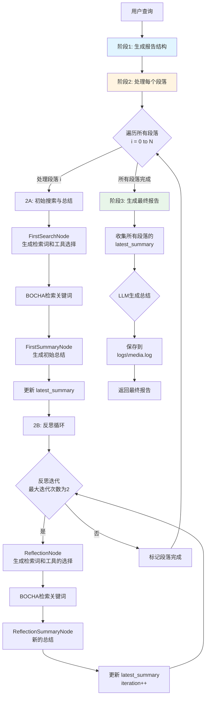

## Media Engine 执行流程图

```mermaid
graph TB
    Start["用户查询"] --> Phase1["阶段1: 生成报告结构"]
        
    Phase1 --> Phase2["阶段2: 处理每个段落"]
    
    Phase2 --> LoopPara{"遍历所有段落<br/>i = 0 to N"}
    
    LoopPara -->|处理段落 i| InitSearch["2A: 初始搜索与总结"]
    
    InitSearch --> FSN["FirstSearchNode<br/>生成检索词和工具选择"]
    FSN --> ExecTool["BOCHA检索关键词"]
    
    ExecTool --> FSUM["FirstSummaryNode<br/>生成初始总结"]
    FSUM --> SaveHistory["更新 latest_summary"]
    
    SaveHistory --> Reflection["2B: 反思循环"]
    
    Reflection --> RefLoop{"反思迭代<br> 最大迭代次数为2"}
    
    RefLoop -->|是| REF["ReflectionNode<br/>生成检索词和工具的选择"]
 
    REF --> ExecTool2["BOCHA检索关键词"]
    ExecTool2 --> RSUM["ReflectionSummaryNode<br/>新的总结"]
    RSUM --> UpdateSum["更新 latest_summary<br/>iteration++"]
    UpdateSum --> RefLoop
    
    RefLoop -->|否| MarkDone["标记段落完成"]
    MarkDone --> LoopPara
    
    LoopPara -->|所有段落完成| Phase3["阶段3: 生成最终报告"]
    
    Phase3 --> Collect["收集所有段落的<br/>latest_summary"]
    Collect --> TryLLM{"LLM生成总结"}
    TryLLM --> MDFile["保存到<br/>logs\media.log"]
    MDFile --> End["返回最终报告"]
    
    style Phase1 fill:#e1f5ff
    style Phase2 fill:#fff4e1
    style Phase3 fill:#e8f5e9
 
```

