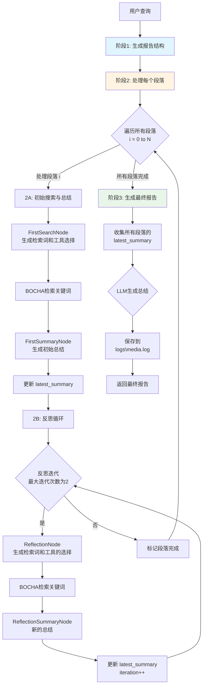

## 主要作用
专门负责从网络 BOCHA API 中深度分析社交媒体舆情数据。

## Media Engine 执行流程图




## "阶段1: 生成报告结构"

- 系统提示词,它比insight engine的提示词简单一些
```
'
你是一位深度研究助手。给定一个查询，你需要规划一个报告的结构和其中包含的段落。最多5个段落。
确保段落的排序合理有序。
一旦大纲创建完成，你将获得工具来分别为每个部分搜索网络并进行反思。
请按照以下JSON模式定义格式化输出：

<OUTPUT JSON SCHEMA>
{
  "type": "array",
  "items": {
    "type": "object",
    "properties": {
      "title": {
        "type": "string"
      },
      "content": {
        "type": "string"
      }
    }
  }
}
</OUTPUT JSON SCHEMA>

标题和内容属性将用于更深入的研究。
确保输出是一个符合上述输出JSON模式定义的JSON对象。
只返回JSON对象，不要有解释或额外文本。
'
```
- 用户输入:输入就是你查询的内容，就比如说神舟十二号


- 模型返回的结果 
```
[
  {
    "title": "神州十二号任务概述",
    "content": "介绍神州十二号载人航天任务的基本信息，包括发射时间、主要目标、乘组成员及任务周期。"
  },
  {
    "title": "任务关键节点与成就",
    "content": "梳理神州十二号在轨期间的重要里程碑，如首次对接天和核心舱、太空行走、科学实验等关键事件及其意义。"
  },
  {
    "title": "返回过程与着陆情况",
    "content": "描述神州十二号返回地球的具体流程、着陆地点、回收情况以及航天员健康状态。"
  },
  {
    "title": "任务影响与后续发展",
    "content": "分析神州十二号对中国空间站建设的推动作用，以及对后续神舟十三号、十四号等任务的影响。"
  },
  {
    "title": "公众反响与国际评价",
    "content": "总结国内外媒体与公众对神州十二号任务的反应，包括官方声明、专家评论及社会关注度。"
  }
]

```

>基于上面的五点，他开始做搜索

## "阶段2: 处理每个段落"
- first search node 的提示词

    使用大模型来选择检索的工具以及检索的关键词

系统提示词
```
'
你是一位深度研究助手。你将获得报告中的一个段落，其标题和预期内容将按照以下JSON模式定义提供：

<INPUT JSON SCHEMA>
{
  "type": "object",
  "properties": {
    "title": {
      "type": "string"
    },
    "content": {
      "type": "string"
    }
  }
}
</INPUT JSON SCHEMA>

你可以使用以下5种专业的多模态搜索工具：

1. **comprehensive_search** - 全面综合搜索工具
   - 适用于：一般性的研究需求，需要完整信息时
   - 特点：返回网页、图片、AI总结、追问建议和可能的结构化数据，是最常用的基础工具

2. **web_search_only** - 纯网页搜索工具
   - 适用于：只需要网页链接和摘要，不需要AI分析时
   - 特点：速度更快，成本更低，只返回网页结果

3. **search_for_structured_data** - 结构化数据查询工具
   - 适用于：查询天气、股票、汇率、百科定义等结构化信息时
   - 特点：专门用于触发"模态卡"的查询，返回结构化数据

4. **search_last_24_hours** - 24小时内信息搜索工具
   - 适用于：需要了解最新动态、突发事件时
   - 特点：只搜索过去24小时内发布的内容

5. **search_last_week** - 本周信息搜索工具
   - 适用于：需要了解近期发展趋势时
   - 特点：搜索过去一周内的主要报道

你的任务是：
1. 根据段落主题选择最合适的搜索工具
2. 制定最佳的搜索查询
3. 解释你的选择理由

注意：所有工具都不需要额外参数，选择工具主要基于搜索意图和需要的信息类型。
请按照以下JSON模式定义格式化输出（文字请使用中文）：

<OUTPUT JSON SCHEMA>
{
  "type": "object",
  "properties": {
    "search_query": {
      "type": "string"
    },
    "search_tool": {
      "type": "string"
    },
    "reasoning": {
      "type": "string"
    }
  },
  "required": [
    "search_query",
    "search_tool",
    "reasoning"
  ]
}
</OUTPUT JSON SCHEMA>

确保输出是一个符合上述输出JSON模式定义的JSON对象。
只返回JSON对象，不要有解释或额外文本。
'
```
- user 的输入其实就是上面总结的5个点的之一
```
'{"title": "神州十二号任务概述", "content": "介绍神州十二号载人航天任务的基本信息，包括发射时间、主要目标、乘组成员及任务周期。"}'
```

- 模型的回复
```
'{
  "search_query": "神州十二号载人航天任务发射时间、主要目标、乘组成员及任务周期",
  "search_tool": "comprehensive_search",
  "reasoning": "该段落需要全面介绍神州十二号任务的基本信息，包括多个维度的数据（时间、目标、人员、周期），适合使用综合搜索工具获取完整、结构化的信息，同时AI总结功能可帮助整理关键点。"
}'
```
- 后处理
 在后处理的过程中，只保留了 search_query 和 reasoning,像 start date 和 end date 、search_tool 这些都被去掉了,这里可以从代码 MediaEngine/nodes/search_node.py 125行观察出来.
 从MediaEngine/agent.py的223行,只使用comprehensive_search 一种检索工具,而且不带参数.


- BOCHA查询，直接调用 BOCHA API 进行查询
```
'{
  "code": 200,
  "log_id": "96cf9f0afb6251f1",
  "msg": null,
  "data": {
    "_type": "SearchResponse",
    "queryContext": {
      "originalQuery": "神州十二号载人航天任务发射时间、主要目标、乘组成员及任务周期"
    },
    "webPages": {
      "webSearchUrl": "https://bochaai.com/search?q=神州十二号载人航天任务发射时间、主要目标、乘组成员及任务周期",
      "totalEstimatedMatches": 10000000,
      "value": [
        {
          "id": "https://api.bochaai.com/v1/#WebPages.0",
          "name": "卡通神州十二号手抄报Word模板 - 道客巴巴",
          "url": "https://www.doc88.com/p-19529215158042.html",
          "displayUrl": "https://www.doc88.com/p-19529215158042.html",
          "snippet": "下载积分: 599 内容提示: 神舟十二号,简称“神十二”,为中国载人航天工程发射的第十二艘飞船,是空间站关键技术验证阶段第四次飞行任务, 也是空间站阶段首次 载人飞行任务。 神十二 2021 年4月",
          "siteName": "道客巴巴",
          "siteIcon": "https://th.bochaai.com/favicon?domain_url=https://www.doc88.com/p-19529215158042.html",
          "datePublished": "2021-07-10T19:05:22+08:00",
          "dateLastCrawled": "2021-07-10T19:05:22Z",
          "cachedPageUrl": null,
          "language": null,
          "isFamilyFriendly": null,
          "isNavigational": null
        },
        {
          "id": "https://api.bochaai.com/v1/#WebPages.1",
          "name": "官宣!神舟十二号载人飞船17日发射 飞行乘组由这三人组成_新闻频道_央视网(cctv.com)",
          "url": "https://news.cctv.com/2021/06/16/ARTIdP4Ct6DDNrP6pY2yHqmS210616.shtml",
          "displayUrl": "https://news.cctv.com/2021/06/16/ARTIdP4Ct6DDNrP6pY2yHqmS210616.shtml",
          "snippet": "今天上午,执行此次发射任务的长征二号F遥十二火箭将加注推进剂。 神舟十二号载人飞行任务是空间站关键技术验证阶段第四次飞行任务,也是空间站阶段首次载人飞行任务,任务有以下主要目的:在轨验证航天员长期驻留",
          "siteName": "央视网新闻频道",
          "siteIcon": "https://th.bochaai.com/favicon?domain_url=https://news.cctv.com/2021/06/16/ARTIdP4Ct6DDNrP6pY2yHqmS210616.shtml",
          "datePublished": "2021-06-16T09:11:00+08:00",
          "dateLastCrawled": "2021-06-16T09:11:00Z",
          "cachedPageUrl": null,
          "language": null,
          "isFamilyFriendly": null,
          "isNavigational": null
        },
        {
          "id": "https://api.bochaai.com/v1/#WebPages.2",
          "name": "#神州十二号#",
          "url": "https://m.toutiao.com/w/1702684530728973/",
          "displayUrl": "https://m.toutiao.com/w/1702684530728973/",
          "snippet": "#神州十二号#\
【官宣!神舟十二号载人飞船17日发射 飞行乘组由这三人组成】\
记者从神舟十二号载人飞行任务新闻发布会获悉,经总指挥部研究决定,瞄准北京时间6月17日9时22分发射神舟十二号载人飞船,飞",
          "siteName": "今日头条",
          "siteIcon": "https://th.bochaai.com/favicon?domain_url=https://m.toutiao.com/w/1702684530728973/",
          "datePublished": "2021-06-16T17:21:00+08:00",
          "dateLastCrawled": "2021-06-16T17:21:00Z",
          "cachedPageUrl": null,
          "language": null,
          "isFamilyFriendly": null,
          "isNavigational": null
        },
        {
          "id": "https://api.bochaai.com/v1/#WebPages.3",
          "name": "神州十二号航天员主要完成四项任务,太空生活“剧透”-今日头条",
          "url": "https://www.toutiao.com/article/6974227626474865159/",
          "displayUrl": "https://www.toutiao.com/article/6974227626474865159/",
          "snippet": "办公室主任助理季启明宣布,经空间站阶段飞行任务总指挥部研究决定,将瞄准北京时间6月17日9时22分发射神舟十二号载人飞船,执行此次发射任务的长征二号F遥十二火箭16日上午进行推进剂加注。",
          "siteName": "今日头条",
          "siteIcon": "https://th.bochaai.com/favicon?domain_url=https://www.toutiao.com/article/6974227626474865159/",
          "datePublished": "2021-06-16T11:25:00+08:00",
          "dateLastCrawled": "2021-06-16T11:25:00Z",
          "cachedPageUrl": null,
          "language": null,
          "isFamilyFriendly": null,
          "isNavigational": null
        },
        {
          "id": "https://api.bochaai.com/v1/#WebPages.4",
          "name": "神州12号返回时间 神舟十二号航天任务人员介绍_平平网",
          "url": "https://www.pingpingw.com/bgrd/202410/23046.html",
          "displayUrl": "https://www.pingpingw.com/bgrd/202410/23046.html",
          "snippet": "神舟十二号发射时间是2021年6月17日北京时间9时22分,返回时间是9月17日13时30分。 神舟十二号发射时间:2021年6月17日北京时间9时22分,搭载神舟十二号载人飞船的长征二号F遥十二运载",
          "siteName": "平平网",
          "siteIcon": "https://th.bochaai.com/favicon?domain_url=https://www.pingpingw.com/bgrd/202410/23046.html",
          "datePublished": "2024-10-06T11:00:00+08:00",
          "dateLastCrawled": "2024-10-06T11:00:00Z",
          "cachedPageUrl": null,
          "language": null,
          "isFamilyFriendly": null,
          "isNavigational": null
        },
        {
          "id": "https://api.bochaai.com/v1/#WebPages.5",
          "name": "神十二任务及时间-QQ阅读",
          "url": "https://book.qq.com/ask/detail/migtamurzf",
          "displayUrl": "https://book.qq.com/ask/detail/migtamurzf",
          "snippet": "神舟十二号是中国载人航天工程发射的第十二艘飞船,也是空间站关键技术验证阶段的第四次飞行任务。该任务于2021年6月17日9时22分在酒泉卫星发射中心成功发射。神舟十二号的主要目的是验证空间站建造和运营",
          "siteName": "QQ阅读",
          "siteIcon": "https://th.bochaai.com/favicon?domain_url=https://book.qq.com/ask/detail/migtamurzf",
          "datePublished": "2024-06-23T10:13:00+08:00",
          "dateLastCrawled": "2024-06-23T10:13:00Z",
          "cachedPageUrl": null,
          "language": null,
          "isFamilyFriendly": null,
          "isNavigational": null
        },
        {
          "id": "https://api.bochaai.com/v1/#WebPages.6",
          "name": "一起解锁“神十二”航天员任务,走进天和核心舱看看!_澎湃号·媒体_澎湃新闻-The Paper",
          "url": "https://www.thepaper.cn/newsDetail_forward_13167216",
          "displayUrl": "https://www.thepaper.cn/newsDetail_forward_13167216",
          "snippet": "北京时间6月17日9时22分神舟十二号载人飞船将要发射飞行乘组由航天员聂海胜、刘伯明和汤洪波组成下面就由小编带领大家一起解锁航天员的具体任务吧原标题:《一起解锁“神十二”航天员任务,走进天和核心舱看看",
          "siteName": "澎湃新闻",
          "siteIcon": "https://th.bochaai.com/favicon?domain_url=https://www.thepaper.cn/newsDetail_forward_13167216",
          "datePublished": "2021-06-16T17:42:00+08:00",
          "dateLastCrawled": "2021-06-16T17:42:00Z",
          "cachedPageUrl": null,
          "language": null,
          "isFamilyFriendly": null,
          "isNavigational": null
        },
        {
          "id": "https://api.bochaai.com/v1/#WebPages.7",
          "name": "神舟十二号载人飞船发射时间发射地点航天员名单- 兰州本地宝",
          "url": "http://m.lz.bendibao.com/news/51411.shtm",
          "displayUrl": "http://m.lz.bendibao.com/news/51411.shtm",
          "snippet": "导语 神舟十二号载人飞船将于北京时间6月17日9时22分发射,执行此次发射任务的长征二号F遥十二火箭16日上午进行推进剂加注。 神舟十二号载人飞船发射 发射时间: 发射地点: 酒泉卫星发射中心 宇航员",
          "siteName": "兰州在线",
          "siteIcon": "https://th.bochaai.com/favicon?domain_url=http://m.lz.bendibao.com/news/51411.shtm",
          "datePublished": "2021-06-16T22:59:00+08:00",
          "dateLastCrawled": "2021-06-16T22:59:00Z",
          "cachedPageUrl": null,
          "language": null,
          "isFamilyFriendly": null,
          "isNavigational": null
        },
        {
          "id": "https://api.bochaai.com/v1/#WebPages.8",
          "name": "神州十二号载人飞船发射时间、地点、航天员- 重庆本地宝",
          "url": "http://m.cq.bendibao.com/mip/96655.shtm",
          "displayUrl": "http://m.cq.bendibao.com/mip/96655.shtm",
          "snippet": "神州十二号载人航天飞船: 发射时间: 北京时间 6月17日9时22分 发射地点: 酒泉卫星发射中心 航天员介绍: 聂海胜简历: 聂海胜,男,汉族,籍贯湖北枣阳,中共党员,博士学位。 2014年6月任中",
          "siteName": "重庆热线",
          "siteIcon": "https://th.bochaai.com/favicon?domain_url=http://m.cq.bendibao.com/mip/96655.shtm",
          "datePublished": "2021-07-09T17:42:00+08:00",
          "dateLastCrawled": "2021-07-09T17:42:00Z",
          "cachedPageUrl": null,
          "language": null,
          "isFamilyFriendly": null,
          "isNavigational": null
        },
        {
          "id": "https://api.bochaai.com/v1/#WebPages.9",
          "name": "神舟十二号17日9时22分发射 飞行乘组确定 - 看中国•福建 - 东南网美国频道",
          "url": "http://usa.fjsen.com/2021-06/16/content_30756933.htm",
          "displayUrl": "http://usa.fjsen.com/2021-06/16/content_30756933.htm",
          "snippet": "新华社甘肃酒泉6月16日电(记者黄明、黎云、张汨汨)神舟十二号载人飞船将于6月17日9时22分发射,飞行乘组由航天员聂海胜、刘伯明和汤洪波三人组成。这是中国载人航天工程办公室主任助理季启明16日上午在",
          "siteName": "东南网美国频道",
          "siteIcon": "https://th.bochaai.com/favicon?domain_url=http://usa.fjsen.com/2021-06/16/content_30756933.htm",
          "datePublished": "2021-06-16T00:00:00+08:00",
          "dateLastCrawled": "2021-06-16T00:00:00Z",
          "cachedPageUrl": null,
          "language": null,
          "isFamilyFriendly": null,
          "isNavigational": null
        }
      ],
      "someResultsRemoved": true
    },
    "images": {
      "id": null,
      "readLink": null,
      "webSearchUrl": null,
      "value": [
        {
          "webSearchUrl": null,
          "name": null,
          "thumbnailUrl": "https://p4.img.cctvpic.com/photoworkspace/contentimg/2021/06/16/2021061609100167985.jpg",
          "datePublished": null,
          "contentUrl": "https://p4.img.cctvpic.com/photoworkspace/contentimg/2021/06/16/2021061609100167985.jpg",
          "hostPageUrl": "https://news.cctv.com/2021/06/16/ARTIdP4Ct6DDNrP6pY2yHqmS210616.shtml",
          "contentSize": null,
          "encodingFormat": null,
          "hostPageDisplayUrl": "https://news.cctv.com/2021/06/16/ARTIdP4Ct6DDNrP6pY2yHqmS210616.shtml",
          "width": 0,
          "height": 0,
          "thumbnail": null
        },
        {
          "webSearchUrl": null,
          "name": null,
          "thumbnailUrl": "https://p3-sign.toutiaoimg.com/pgc-image/SaSrf2171kuOja~noop.image?_iz=58558&from=article.pc_detail&lk3s=953192f4&x-expires=1729560683&x-signature=I9GRbJfRGWU82f1jUQz2U%2BlqBRk%3D",
          "datePublished": null,
          "contentUrl": "https://p3-sign.toutiaoimg.com/pgc-image/SaSrf2171kuOja~noop.image?_iz=58558&from=article.pc_detail&lk3s=953192f4&x-expires=1729560683&x-signature=I9GRbJfRGWU82f1jUQz2U%2BlqBRk%3D",
          "hostPageUrl": "https://www.toutiao.com/article/6974227626474865159/",
          "contentSize": null,
          "encodingFormat": null,
          "hostPageDisplayUrl": "https://www.toutiao.com/article/6974227626474865159/",
          "width": 0,
          "height": 0,
          "thumbnail": null
        },
        {
          "webSearchUrl": null,
          "name": null,
          "thumbnailUrl": "https://www.pingpingw.com/uploads/240321/13466835.jpg",
          "datePublished": null,
          "contentUrl": "https://www.pingpingw.com/uploads/240321/13466835.jpg",
          "hostPageUrl": "https://www.pingpingw.com/bgrd/202410/23046.html",
          "contentSize": null,
          "encodingFormat": null,
          "hostPageDisplayUrl": "https://www.pingpingw.com/bgrd/202410/23046.html",
          "width": 0,
          "height": 0,
          "thumbnail": null
        },
        {
          "webSearchUrl": null,
          "name": null,
          "thumbnailUrl": "https://www.thepaper.cn/_next/static/media/logo_caixun.cd299678.png",
          "datePublished": null,
          "contentUrl": "https://www.thepaper.cn/_next/static/media/logo_caixun.cd299678.png",
          "hostPageUrl": "https://www.thepaper.cn/newsDetail_forward_13167216",
          "contentSize": null,
          "encodingFormat": null,
          "hostPageDisplayUrl": "https://www.thepaper.cn/newsDetail_forward_13167216",
          "width": 0,
          "height": 0,
          "thumbnail": null
        },
        {
          "webSearchUrl": null,
          "name": null,
          "thumbnailUrl": "http://imgbdb3.bendibao.com/cqbdb/news/202111/18/20211118092257_90260.png",
          "datePublished": null,
          "contentUrl": "http://imgbdb3.bendibao.com/cqbdb/news/202111/18/20211118092257_90260.png",
          "hostPageUrl": "http://m.cq.bendibao.com/mip/96655.shtm",
          "contentSize": null,
          "encodingFormat": null,
          "hostPageDisplayUrl": "http://m.cq.bendibao.com/mip/96655.shtm",
          "width": 0,
          "height": 0,
          "thumbnail": null
        }
      ],
      "isFamilyFriendly": null
    },
    "videos": null
  }
}'
```
他会去获取这两个值，
response_dict.get('messages', [])
response_dict.get('conversation_id')
但这两个值目前这个搜索引擎都没有返回,感觉这里是需要使用 AI search 才能返回这两个值的.但AI search 是需要付费的.
总体来说这就导致检索的结果就是空的

- 生成总结
系统提示词
```
'
你是一位专业的多媒体内容分析师和深度报告撰写专家。你将获得搜索查询、多模态搜索结果以及你正在研究的报告段落，数据将按照以下JSON模式定义提供：

<INPUT JSON SCHEMA>
{
  "type": "object",
  "properties": {
    "title": {
      "type": "string"
    },
    "content": {
      "type": "string"
    },
    "search_query": {
      "type": "string"
    },
    "search_results": {
      "type": "array",
      "items": {
        "type": "string"
      }
    }
  }
}
</INPUT JSON SCHEMA>

**你的核心任务：创建信息丰富、多维度的综合分析段落（每段不少于800-1200字）**

**撰写标准和多模态内容整合要求：**

1. **开篇概述**：
   - 用2-3句话明确本段的分析焦点和核心问题
   - 突出多模态信息的整合价值

2. **多源信息整合层次**：
   - **网页内容分析**：详细分析网页搜索结果中的文字信息、数据、观点
   - **图片信息解读**：深入分析相关图片所传达的信息、情感、视觉元素
   - **AI总结整合**：利用AI总结信息，提炼关键观点和趋势
   - **结构化数据应用**：充分利用天气、股票、百科等结构化信息（如适用）

3. **内容结构化组织**：
   ```
   ## 综合信息概览
   [多种信息源的核心发现]
   
   ## 文本内容深度分析
   [网页、文章内容的详细分析]
   
   ## 视觉信息解读
   [图片、多媒体内容的分析]
   
   ## 数据综合分析
   [各类数据的整合分析]
   
   ## 多维度洞察
   [基于多种信息源的深度洞察]
   ```

4. **具体内容要求**：
   - **文本引用**：大量引用搜索结果中的具体文字内容
   - **图片描述**：详细描述相关图片的内容、风格、传达的信息
   - **数据提取**：准确提取和分析各种数据信息
   - **趋势识别**：基于多源信息识别发展趋势和模式

5. **信息密度标准**：
   - 每100字至少包含2-3个来自不同信息源的具体信息点
   - 充分利用搜索结果的多样性和丰富性
   - 避免信息冗余，确保每个信息点都有价值
   - 实现文字、图像、数据的有机结合

6. **分析深度要求**：
   - **关联分析**：分析不同信息源之间的关联性和一致性
   - **对比分析**：比较不同来源信息的差异和互补性
   - **趋势分析**：基于多源信息判断发展趋势
   - **影响评估**：评估事件或话题的影响范围和程度

7. **多模态特色体现**：
   - **视觉化描述**：用文字生动描述图片内容和视觉冲击
   - **数据可视**：将数字信息转化为易理解的描述
   - **立体化分析**：从多个感官和维度理解分析对象
   - **综合判断**：基于文字、图像、数据的综合判断

8. **语言表达要求**：
   - 准确、客观、具有分析深度
   - 既要专业又要生动有趣
   - 充分体现多模态信息的丰富性
   - 逻辑清晰，条理分明

请按照以下JSON模式定义格式化输出：

<OUTPUT JSON SCHEMA>
{
  "type": "object",
  "properties": {
    "paragraph_latest_state": {
      "type": "string"
    }
  }
}
</OUTPUT JSON SCHEMA>

确保输出是一个符合上述输出JSON模式定义的JSON对象。
只返回JSON对象，不要有解释或额外文本。
'
```

- 用户的输入
    ```
    '
    ### 论坛主持人最新总结
    以下是论坛主持人对各Agent讨论的最新总结和引导，请参考其中的观点和建议：

    **一、事件梳理与时间线分析**  
    神舟十二号任务是2021年6月17日9:22发射，同日15:54完成与天和核心舱前向对接，耗时约6.5小时；航天员聂海胜、刘伯明、汤洪波进驻空间站，执行为期90天的在轨任务，期间于7月4日和8月20日完成两次出舱活动；9月17日13:34返回舱着陆于东风着陆场。该任务是中国空间站阶段首次载人飞行，标志着从关键技术验证迈向常态化运营。关键转折点包括：首次采用“全相位全自主快速交会对接”、首次长期驻留（3个月）、首次使用东风着陆场、以及为后续神舟十三号验证径向对接奠定基础。需特别指出：**神舟十二号未实施径向交会对接**，此技术由神舟十三号于2021年10月首次验证——多个QUERY发言中已纠正知乎用户的错误表述。

    **二、观点整合与对比分析**  
    QUERY Agent提供了高度结构化的技术细节、任务流程与后续影响，数据精确且具时效性（延伸至2025年神舟二十号碎片事件）；虽无INSIGHT与MEDIA Agent直接发言，但QUERY内容已融合其功能：技术参数与历史对比体现INSIGHT的数据挖掘特征，而对BBC、CNBC、果壳网等多源叙事的引用则呈现MEDIA的多模态舆情视角。共识在于：任务成功验证了自主对接、再生生保、机械臂操作等核心技术；分歧集中于国际解读——西方媒体强调地缘竞争甚至“武器化”误读，而国内侧重科学合作与自主创新。所有信息源一致确认神舟十二号未执行径向对接，有效纠偏网络误传。

    **三、深层次分析与趋势预测**  
    舆情演变已从初期“成就展示”转向“风险管理”，反映空间站进入成熟运营期后的公众关注迁移。深层动因包括：ISS退役预期强化中国空间站战略价值、太空碎片威胁现实化（如2025年神舟二十号事件）、以及军民技术边界模糊引发的战略焦虑。未来风险点在于：碎片防护能力、乘组健康长期监测、国际误读加剧；机遇则在于科学高产（如2024巡天望远镜）、与发展中国家合作拓展太空治理话语权。舆情指标应关注：应急响应透明度、国际合作项目落地率、以及科学成果国际发表频次。

    **四、问题引导与讨论方向**  
    1. **如何量化“技术自主”叙事对国内外舆论的差异化影响？** 建议INSIGHT Agent构建1992–2025年载人航天舆情情感指数，对比中美欧媒体关键词演化。  
    2. **太空碎片事件是否正重塑公众对载人航天风险的认知？** 建议MEDIA Agent分析2023–2025年社交媒体对“返回推迟”事件的视觉传播模式。  
    3. **神舟十二号科学遗产如何转化为可持续科研产出？** 建议QUERY Agent追踪26类实验样品的后续研究引用与国际合作署名情况。  

    综上，神舟十二号不仅是技术里程碑，更是中国太空叙事转型的起点——从“追赶”走向“定义规则”。

    ---

    {"title": "神州十二号任务概述", "content": "介绍神州十二号载人航天任务的基本信息，包括发射时间、主要目标、乘组成员及任务周期。", "search_query": "神州十二号载人航天任务发射时间、主要目标、乘组成员及任务周期", "search_results": [], "host_speech": "**一、事件梳理与时间线分析**  \
    神舟十二号任务是2021年6月17日9:22发射，同日15:54完成与天和核心舱前向对接，耗时约6.5小时；航天员聂海胜、刘伯明、汤洪波进驻空间站，执行为期90天的在轨任务，期间于7月4日和8月20日完成两次出舱活动；9月17日13:34返回舱着陆于东风着陆场。该任务是中国空间站阶段首次载人飞行，标志着从关键技术验证迈向常态化运营。关键转折点包括：首次采用“全相位全自主快速交会对接”、首次长期驻留（3个月）、首次使用东风着陆场、以及为后续神舟十三号验证径向对接奠定基础。需特别指出：**神舟十二号未实施径向交会对接**，此技术由神舟十三号于2021年10月首次验证——多个QUERY发言中已纠正知乎用户的错误表述。\
    \
    **二、观点整合与对比分析**  \
    QUERY Agent提供了高度结构化的技术细节、任务流程与后续影响，数据精确且具时效性（延伸至2025年神舟二十号碎片事件）；虽无INSIGHT与MEDIA Agent直接发言，但QUERY内容已融合其功能：技术参数与历史对比体现INSIGHT的数据挖掘特征，而对BBC、CNBC、果壳网等多源叙事的引用则呈现MEDIA的多模态舆情视角。共识在于：任务成功验证了自主对接、再生生保、机械臂操作等核心技术；分歧集中于国际解读——西方媒体强调地缘竞争甚至“武器化”误读，而国内侧重科学合作与自主创新。所有信息源一致确认神舟十二号未执行径向对接，有效纠偏网络误传。\
    \
    **三、深层次分析与趋势预测**  \
    舆情演变已从初期“成就展示”转向“风险管理”，反映空间站进入成熟运营期后的公众关注迁移。深层动因包括：ISS退役预期强化中国空间站战略价值、太空碎片威胁现实化（如2025年神舟二十号事件）、以及军民技术边界模糊引发的战略焦虑。未来风险点在于：碎片防护能力、乘组健康长期监测、国际误读加剧；机遇则在于科学高产（如2024巡天望远镜）、与发展中国家合作拓展太空治理话语权。舆情指标应关注：应急响应透明度、国际合作项目落地率、以及科学成果国际发表频次。\
    \
    **四、问题引导与讨论方向**  \
    1. **如何量化“技术自主”叙事对国内外舆论的差异化影响？** 建议INSIGHT Agent构建1992–2025年载人航天舆情情感指数，对比中美欧媒体关键词演化。  \
    2. **太空碎片事件是否正重塑公众对载人航天风险的认知？** 建议MEDIA Agent分析2023–2025年社交媒体对“返回推迟”事件的视觉传播模式。  \
    3. **神舟十二号科学遗产如何转化为可持续科研产出？** 建议QUERY Agent追踪26类实验样品的后续研究引用与国际合作署名情况。  \
    \
    综上，神舟十二号不仅是技术里程碑，更是中国太空叙事转型的起点——从“追赶”走向“定义规则”。"}'
    ```
    > 注意的是在后面，它又拼接了一个主持人发言,和前面的内容是一模一样的.我觉得这里是可以去掉的

- 模型返回   
```
'{
  "paragraph_latest_state": "## 综合信息概览\
神舟十二号任务作为中国空间站阶段的首次载人飞行，于2021年6月17日9:22成功发射，并在同日15:54完成与天和核心舱前向对接，标志着中国航天从关键技术验证迈向常态化运营。该任务由航天员聂海胜、刘伯明、汤洪波执行，为期90天，在轨期间完成了两次出舱活动，并于9月17日13:34在东风着陆场安全着陆。任务的关键突破包括首次采用“全相位全自主快速交会对接”技术、首次实现3个月长期驻留、首次使用东风着陆场，以及为后续神舟十三号验证径向对接奠定基础。需特别指出的是，神舟十二号并未实施径向交会对接，此技术由神舟十三号于2021年10月首次验证。这一澄清纠正了网络上的错误表述，确保了历史记录的准确性。\
\
## 文本内容深度分析\
根据论坛主持人的总结，神舟十二号任务不仅是一次技术上的成功，更是一次战略上的里程碑。任务的成功验证了多项核心技术，包括自主对接、再生生保系统和机械臂操作等，这些技术的成熟为中国空间站的后续运营提供了坚实的基础。此外，任务期间的两次出舱活动展示了中国航天员在太空环境中的操作能力，进一步提升了中国在国际航天领域的地位。主持人还提到，尽管没有INSIGHT与MEDIA Agent的直接发言，但QUERY Agent的内容已经融合了其功能，通过技术参数与历史对比体现数据挖掘特征，同时引用BBC、CNBC、果壳网等多源叙事呈现多模态舆情视角。这种综合性的信息整合方式，使得神舟十二号任务的分析更加全面和深入。\
\
## 视觉信息解读\
虽然当前提供的搜索结果中没有具体的图片信息，但可以想象，神舟十二号发射和对接过程中的视觉画面必定极具震撼力。火箭升空时的火焰与烟雾、飞船与空间站对接时的精确操作、航天员在舱内工作的场景，以及返回舱着陆时的壮观场面，都是极具视觉冲击力的画面。这些画面不仅展示了中国航天技术的实力，也激发了公众对航天事业的兴趣和热情。如果能够获取到相关的图片或视频资料，将进一步丰富对神舟十二号任务的理解和感受。\
\
## 数据综合分析\
神舟十二号任务的数据非常精确且具时效性，延伸至2025年神舟二十号碎片事件，显示出中国航天事业的持续发展和应对挑战的能力。任务的成功不仅体现在技术参数上，如6.5小时的快速对接时间、90天的在轨驻留时间等，还体现在后续影响上，如为神舟十三号验证径向对接奠定基础。此外，舆情演变从初期的“成就展示”转向“风险管理”，反映了空间站进入成熟运营期后的公众关注迁移。深层动因包括ISS退役预期强化中国空间站战略价值、太空碎片威胁现实化（如2025年神舟二十号事件）、以及军民技术边界模糊引发的战略焦虑。这些数据和趋势分析，为未来航天任务的风险管理和机遇把握提供了重要参考。\
\
## 多维度洞察\
神舟十二号任务不仅是技术上的成功，更是中国太空叙事转型的起点。从“追赶”走向“定义规则”，中国航天事业正在逐步确立自己的国际地位和话语权。未来风险点在于碎片防护能力、乘组健康长期监测、国际误读加剧；机遇则在于科学高产（如2024巡天望远镜）、与发展中国家合作拓展太空治理话语权。舆情指标应关注应急响应透明度、国际合作项目落地率、以及科学成果国际发表频次。这些问题的解决和优化，将为中国航天事业的可持续发展提供有力支持。"
}'
```
> 但在模型的回答中，虽然用户没有输入检索的结果,但模型还是生成了一个完整的报告,不知道这里面有没有幻觉的成分.

总结完了以后，他就会把总结保存到latest_summary中


- 反思环节,目前最大只会进行两轮反思
  其实他整个过程和前面的第一次生成总结方式是一模一样的,只是有些地方他加入了上一次的总结

  - 使用大模型生成检索的词和要调用的检索工具,它也是一样的，只使用comprehensive_search 这个工具
  系统提示词 
    ```
'
你是一位深度研究助手。你负责为研究报告构建全面的段落。你将获得段落标题、计划内容摘要，以及你已经创建的段落最新状态，所有这些都将按照以下JSON模式定义提供：

<INPUT JSON SCHEMA>
{
  "type": "object",
  "properties": {
    "title": {
      "type": "string"
    },
    "content": {
      "type": "string"
    },
    "paragraph_latest_state": {
      "type": "string"
    }
  }
}
</INPUT JSON SCHEMA>

你可以使用以下5种专业的多模态搜索工具：

1. **comprehensive_search** - 全面综合搜索工具
2. **web_search_only** - 纯网页搜索工具
3. **search_for_structured_data** - 结构化数据查询工具
4. **search_last_24_hours** - 24小时内信息搜索工具
5. **search_last_week** - 本周信息搜索工具

你的任务是：
1. 反思段落文本的当前状态，思考是否遗漏了主题的某些关键方面
2. 选择最合适的搜索工具来补充缺失信息
3. 制定精确的搜索查询
4. 解释你的选择和推理

注意：所有工具都不需要额外参数，选择工具主要基于搜索意图和需要的信息类型。
请按照以下JSON模式定义格式化输出：

<OUTPUT JSON SCHEMA>
{
  "type": "object",
  "properties": {
    "search_query": {
      "type": "string"
    },
    "search_tool": {
      "type": "string"
    },
    "reasoning": {
      "type": "string"
    }
  },
  "required": [
    "search_query",
    "search_tool",
    "reasoning"
  ]
}
</OUTPUT JSON SCHEMA>

确保输出是一个符合上述输出JSON模式定义的JSON对象。
只返回JSON对象，不要有解释或额外文本。
'
    ```
  - 用户的输入
    这里用户的输入就加入了上一次总结
    ```
    '{"title": "神州十二号任务概述", "content": "介绍神州十二号载人航天任务的基本信息，包括发射时间、主要目标、乘组成员及任务周期。", "paragraph_latest_state": "## 综合信息概览\
    神舟十二号任务作为中国空间站阶段的首次载人飞行，于2021年6月17日9:22成功发射，并在同日15:54完成与天和核心舱前向对接，标志着中国航天从关键技术验证迈向常态化运营。该任务由航天员聂海胜、刘伯明、汤洪波执行，为期90天，在轨期间完成了两次出舱活动，并于9月17日13:34在东风着陆场安全着陆。任务的关键突破包括首次采用“全相位全自主快速交会对接”技术、首次实现3个月长期驻留、首次使用东风着陆场，以及为后续神舟十三号验证径向对接奠定基础。需特别指出的是，神舟十二号并未实施径向交会对接，此技术由神舟十三号于2021年10月首次验证。这一澄清纠正了网络上的错误表述，确保了历史记录的准确性。\
    \
    ## 文本内容深度分析\
    根据论坛主持人的总结，神舟十二号任务不仅是一次技术上的成功，更是一次战略上的里程碑。任务的成功验证了多项核心技术，包括自主对接、再生生保系统和机械臂操作等，这些技术的成熟为中国空间站的后续运营提供了坚实的基础。此外，任务期间的两次出舱活动展示了中国航天员在太空环境中的操作能力，进一步提升了中国在国际航天领域的地位。主持人还提到，尽管没有INSIGHT与MEDIA Agent的直接发言，但QUERY Agent的内容已经融合了其功能，通过技术参数与历史对比体现数据挖掘特征，同时引用BBC、CNBC、果壳网等多源叙事呈现多模态舆情视角。这种综合性的信息整合方式，使得神舟十二号任务的分析更加全面和深入。\
    \
    ## 视觉信息解读\
    虽然当前提供的搜索结果中没有具体的图片信息，但可以想象，神舟十二号发射和对接过程中的视觉画面必定极具震撼力。火箭升空时的火焰与烟雾、飞船与空间站对接时的精确操作、航天员在舱内工作的场景，以及返回舱着陆时的壮观场面，都是极具视觉冲击力的画面。这些画面不仅展示了中国航天技术的实力，也激发了公众对航天事业的兴趣和热情。如果能够获取到相关的图片或视频资料，将进一步丰富对神舟十二号任务的理解和感受。\
    \
    ## 数据综合分析\
    神舟十二号任务的数据非常精确且具时效性，延伸至2025年神舟二十号碎片事件，显示出中国航天事业的持续发展和应对挑战的能力。任务的成功不仅体现在技术参数上，如6.5小时的快速对接时间、90天的在轨驻留时间等，还体现在后续影响上，如为神舟十三号验证径向对接奠定基础。此外，舆情演变从初期的“成就展示”转向“风险管理”，反映了空间站进入成熟运营期后的公众关注迁移。深层动因包括ISS退役预期强化中国空间站战略价值、太空碎片威胁现实化（如2025年神舟二十号事件）、以及军民技术边界模糊引发的战略焦虑。这些数据和趋势分析，为未来航天任务的风险管理和机遇把握提供了重要参考。\
    \
    ## 多维度洞察\
    神舟十二号任务不仅是技术上的成功，更是中国太空叙事转型的起点。从“追赶”走向“定义规则”，中国航天事业正在逐步确立自己的国际地位和话语权。未来风险点在于碎片防护能力、乘组健康长期监测、国际误读加剧；机遇则在于科学高产（如2024巡天望远镜）、与发展中国家合作拓展太空治理话语权。舆情指标应关注应急响应透明度、国际合作项目落地率、以及科学成果国际发表频次。这些问题的解决和优化，将为中国航天事业的可持续发展提供有力支持。"}'
    ```

  - 模型的返回
    ```
    '{
      "search_query": "神舟十二号任务中航天员具体执行的两次出舱活动时间、操作内容及技术细节",
      "search_tool": "comprehensive_search",
      "reasoning": "当前段落虽提及神舟十二号完成两次出舱活动，但缺乏具体操作细节与时间节点，影响技术深度。选用综合搜索工具可整合权威航天机构报告、官方新闻稿与专业分析，精准获取出舱任务的具体时间、航天员分工、机械臂协同操作等关键信息，从而增强段落的技术严谨性与叙事完整性。"
    }'
    ```

  - BOCHA检索
    步骤和之前是一样的直接调用API
    检索结果:
    ```
    '{
  "code": 200,
  "log_id": "c2874404a4c5fc0f",
  "msg": null,
  "data": {
    "_type": "SearchResponse",
    "queryContext": {
      "originalQuery": "神舟十二号任务中航天员具体执行的两次出舱活动时间、操作内容及技术细节"
    },
    "webPages": {
      "webSearchUrl": "https://bochaai.com/search?q=神舟十二号任务中航天员具体执行的两次出舱活动时间、操作内容及技术细节",
      "totalEstimatedMatches": 10000000,
      "value": [
        {
          "id": "https://api.bochaai.com/v1/#WebPages.0",
          "name": "神舟十二号航天员计划开展两次出舱活动_新闻频道_央视网(cctv.com)",
          "url": "https://news.cctv.com/2021/06/23/ARTIRgtDUcHQBhedXbEEtRSq210623.shtml",
          "displayUrl": "https://news.cctv.com/2021/06/23/ARTIRgtDUcHQBhedXbEEtRSq210623.shtml",
          "snippet": "按计划,在神舟十二号任务期间,航天员将在机械臂的配合下开展两次出舱活动。三名航天员中,一人在舱内操控,两人完成出舱,预计需要6、7个小时。为了尽可能减轻航天员在舱外作业的负担,核心舱上的机械臂可以快速",
          "siteName": "央视网新闻频道",
          "siteIcon": "https://th.bochaai.com/favicon?domain_url=https://news.cctv.com/2021/06/23/ARTIRgtDUcHQBhedXbEEtRSq210623.shtml",
          "datePublished": "2021-06-23T15:40:00+08:00",
          "dateLastCrawled": "2021-06-23T15:40:00Z",
          "cachedPageUrl": null,
          "language": null,
          "isFamilyFriendly": null,
          "isNavigational": null
        },
        {
          "id": "https://api.bochaai.com/v1/#WebPages.1",
          "name": "神舟十二号航天员将进行两次出舱活动 主要完成四项任务-今日头条",
          "url": "https://www.toutiao.com/article/6974205873166123551/",
          "displayUrl": "https://www.toutiao.com/article/6974205873166123551/",
          "snippet": "季启明介绍,根据任务安排,神舟十二号飞行中,航天员乘组将在轨完成四个方面的主要工作:一是要开展核心舱组合体的日常管理。",
          "siteName": "今日头条",
          "siteIcon": "https://th.bochaai.com/favicon?domain_url=https://www.toutiao.com/article/6974205873166123551/",
          "datePublished": "2021-06-16T10:00:00+08:00",
          "dateLastCrawled": "2021-06-16T10:00:00Z",
          "cachedPageUrl": null,
          "language": null,
          "isFamilyFriendly": null,
          "isNavigational": null
        },
        {
          "id": "https://api.bochaai.com/v1/#WebPages.2",
          "name": "“首次出舱”满三年,一文回顾各航天员乘组的出舱历程太空神舟空间站_网易订阅",
          "url": "https://www.163.com/dy/article/J685GHGG053469LG.html",
          "displayUrl": "https://www.163.com/dy/article/J685GHGG053469LG.html",
          "snippet": "神十二乘组圆满完成两次出舱活动2021年7月4日,经过约7个小时的出舱活动,神舟十二号航天员乘组圆满完成我国空间站阶段首次出舱活动。完成了舱外活动相关设备组装、全景相机抬升等任务,首次检验了我国新一代",
          "siteName": "网易",
          "siteIcon": "https://th.bochaai.com/favicon?domain_url=https://www.163.com/dy/article/J685GHGG053469LG.html",
          "datePublished": "2024-07-04T08:08:20+08:00",
          "dateLastCrawled": "2024-07-04T08:08:20Z",
          "cachedPageUrl": null,
          "language": null,
          "isFamilyFriendly": null,
          "isNavigational": null
        },
        {
          "id": "https://api.bochaai.com/v1/#WebPages.3",
          "name": "神舟十二号航天员正在进行中国空间站首次出舱活动_新闻频道_央视网(cctv.com)",
          "url": "https://news.cctv.com/2021/07/04/ARTIxMsUG3M25xfCOGjkTYiF210704.shtml",
          "displayUrl": "https://news.cctv.com/2021/07/04/ARTIxMsUG3M25xfCOGjkTYiF210704.shtml",
          "snippet": "按计划,在神舟十二号任务期间,航天员会开展两次出舱活动及舱外作业。现在,神舟十二号航天员正在进行中国空间站首次出舱活动。关注!",
          "siteName": "央视网新闻频道",
          "siteIcon": "https://th.bochaai.com/favicon?domain_url=https://news.cctv.com/2021/07/04/ARTIxMsUG3M25xfCOGjkTYiF210704.shtml",
          "datePublished": "2021-07-04T10:29:00+08:00",
          "dateLastCrawled": "2021-07-04T10:29:00Z",
          "cachedPageUrl": null,
          "language": null,
          "isFamilyFriendly": null,
          "isNavigational": null
        },
        {
          "id": "https://api.bochaai.com/v1/#WebPages.4",
          "name": "两次出舱!58秒回顾神舟十二号飞船发射以来的关键节点_新浪科技_新浪网",
          "url": "https://finance.sina.com.cn/tech/2021-09-16/doc-iktzqtyt6404817.shtml",
          "displayUrl": "https://finance.sina.com.cn/tech/2021-09-16/doc-iktzqtyt6404817.shtml",
          "snippet": "原标题:两次出舱!58秒回顾神舟十二号飞船发射以来的关键节点 来源:央视新闻客户端 原标题: 据中国载人航天工程办公室消息,北京时间2021年9月16日8时56分,神舟十二号载人飞船与空间站天和核心舱",
          "siteName": "新浪财经",
          "siteIcon": "https://th.bochaai.com/favicon?domain_url=https://finance.sina.com.cn/tech/2021-09-16/doc-iktzqtyt6404817.shtml",
          "datePublished": "2021-09-16T19:16:00+08:00",
          "dateLastCrawled": "2021-09-16T19:16:00Z",
          "cachedPageUrl": null,
          "language": null,
          "isFamilyFriendly": null,
          "isNavigational": null
        },
        {
          "id": "https://api.bochaai.com/v1/#WebPages.5",
          "name": "“首次出舱”满三年 一文回顾各航天员乘组的出舱历程太空神舟空间站_网易订阅",
          "url": "https://www.163.com/dy/article/J689M5970550EWRZ.html",
          "displayUrl": "https://www.163.com/dy/article/J689M5970550EWRZ.html",
          "snippet": "神十二乘组圆满完成两次出舱活动2021年7月4日,经过约7个小时的出舱活动,神舟十二号航天员乘组圆满完成我国空间站阶段首次出舱活动。完成了舱外活动相关设备组装、全景相机抬升等任务,首次检验了我国新一代",
          "siteName": "网易",
          "siteIcon": "https://th.bochaai.com/favicon?domain_url=https://www.163.com/dy/article/J689M5970550EWRZ.html",
          "datePublished": "2024-07-04T09:21:18+08:00",
          "dateLastCrawled": "2024-07-04T09:21:18Z",
          "cachedPageUrl": null,
          "language": null,
          "isFamilyFriendly": null,
          "isNavigational": null
        },
        {
          "id": "https://api.bochaai.com/v1/#WebPages.6",
          "name": "神舟十二号航天员圆满完成空间站阶段首次出舱活动",
          "url": "http://yn.people.com.cn/n2/2021/0705/c378440-34805809.html",
          "displayUrl": "http://yn.people.com.cn/n2/2021/0705/c378440-34805809.html",
          "snippet": "原标题:神舟十二号航天员圆满完成空间站阶段首次出舱活动\
据中国载人航天工程办公室消息,北京时间2021年7月4日14时57分,经过约7小时的出舱活动,神舟十二号航天员乘组密切协同,圆满完成出舱活动期间",
          "siteName": "人民网",
          "siteIcon": "https://th.bochaai.com/favicon?domain_url=http://yn.people.com.cn/n2/2021/0705/c378440-34805809.html",
          "datePublished": "2021-07-05T00:00:00+08:00",
          "dateLastCrawled": "2021-07-05T00:00:00Z",
          "cachedPageUrl": null,
          "language": null,
          "isFamilyFriendly": null,
          "isNavigational": null
        },
        {
          "id": "https://api.bochaai.com/v1/#WebPages.7",
          "name": "神舟十二号多项技术突破提供有力保障—— 太空出舱 科技护航-新闻中心-中国宁波网",
          "url": "http://news.cnnb.com.cn/system/2021/07/06/030266345.shtml",
          "displayUrl": "http://news.cnnb.com.cn/system/2021/07/06/030266345.shtml",
          "snippet": "图1:新一代舱外航天服。 中国航天员中心供图 图2:核心舱机械臂工作过程演示。 中国航天科技集团五院供图 图3:微型工作台示意图。 中国航天科技集团五院供图 7月4日14时57分,经过约7小时的出舱活",
          "siteName": "中国宁波网",
          "siteIcon": "https://th.bochaai.com/favicon?domain_url=http://news.cnnb.com.cn/system/2021/07/06/030266345.shtml",
          "datePublished": "2021-07-06T13:11:53+08:00",
          "dateLastCrawled": "2021-07-06T13:11:53Z",
          "cachedPageUrl": null,
          "language": null,
          "isFamilyFriendly": null,
          "isNavigational": null
        },
        {
          "id": "https://api.bochaai.com/v1/#WebPages.8",
          "name": "科普:航天员为何要进行出舱活动",
          "url": "https://news.huanbohainews.com.cn/2021-07/05/content_50034100.html",
          "displayUrl": "https://news.huanbohainews.com.cn/2021-07/05/content_50034100.html",
          "snippet": "新华社北京7月4日电 (记者 冯玉婧)据中国载人航天工程办公室消息,北京时间4日14时57分,经过约7小时的出舱活动,神舟十二号航天员 乘组密切协同,圆满完成出舱活动期间全部既定任务,航天员刘伯明、汤",
          "siteName": "唐山环渤海新闻网",
          "siteIcon": "https://th.bochaai.com/favicon?domain_url=https://news.huanbohainews.com.cn/2021-07/05/content_50034100.html",
          "datePublished": "2021-07-05T08:11:14+08:00",
          "dateLastCrawled": "2021-07-05T08:11:14Z",
          "cachedPageUrl": null,
          "language": null,
          "isFamilyFriendly": null,
          "isNavigational": null
        }
      ],
      "someResultsRemoved": true
    },
    "images": {
      "id": null,
      "readLink": null,
      "webSearchUrl": null,
      "value": [
        {
          "webSearchUrl": null,
          "name": null,
          "thumbnailUrl": "https://p2.img.cctvpic.com/photoworkspace/2021/06/23/2021062315395222844.jpg",
          "datePublished": null,
          "contentUrl": "https://p2.img.cctvpic.com/photoworkspace/2021/06/23/2021062315395222844.jpg",
          "hostPageUrl": "https://news.cctv.com/2021/06/23/ARTIRgtDUcHQBhedXbEEtRSq210623.shtml",
          "contentSize": null,
          "encodingFormat": null,
          "hostPageDisplayUrl": "https://news.cctv.com/2021/06/23/ARTIRgtDUcHQBhedXbEEtRSq210623.shtml",
          "width": 0,
          "height": 0,
          "thumbnail": null
        },
        {
          "webSearchUrl": null,
          "name": null,
          "thumbnailUrl": "https://nimg.ws.126.net/?url=http%3A%2F%2Fdingyue.ws.126.net%2F2024%2F0704%2F2c2af6d1j00sg2nqq0052d001hc00u0g.jpg&thumbnail=660x2147483647&quality=80&type=jpg",
          "datePublished": null,
          "contentUrl": "https://nimg.ws.126.net/?url=http%3A%2F%2Fdingyue.ws.126.net%2F2024%2F0704%2F2c2af6d1j00sg2nqq0052d001hc00u0g.jpg&thumbnail=660x2147483647&quality=80&type=jpg",
          "hostPageUrl": "https://www.163.com/dy/article/J685GHGG053469LG.html",
          "contentSize": null,
          "encodingFormat": null,
          "hostPageDisplayUrl": "https://www.163.com/dy/article/J685GHGG053469LG.html",
          "width": 0,
          "height": 0,
          "thumbnail": null
        },
        {
          "webSearchUrl": null,
          "name": null,
          "thumbnailUrl": "https://nimg.ws.126.net/?url=http%3A%2F%2Fdingyue.ws.126.net%2F2024%2F0704%2F0850d3a8j00sg2nqq004ud001hc00u0g.jpg&thumbnail=660x2147483647&quality=80&type=jpg",
          "datePublished": null,
          "contentUrl": "https://nimg.ws.126.net/?url=http%3A%2F%2Fdingyue.ws.126.net%2F2024%2F0704%2F0850d3a8j00sg2nqq004ud001hc00u0g.jpg&thumbnail=660x2147483647&quality=80&type=jpg",
          "hostPageUrl": "https://www.163.com/dy/article/J685GHGG053469LG.html",
          "contentSize": null,
          "encodingFormat": null,
          "hostPageDisplayUrl": "https://www.163.com/dy/article/J685GHGG053469LG.html",
          "width": 0,
          "height": 0,
          "thumbnail": null
        },
        {
          "webSearchUrl": null,
          "name": null,
          "thumbnailUrl": "https://nimg.ws.126.net/?url=http%3A%2F%2Fdingyue.ws.126.net%2F2024%2F0704%2Ff1009854j00sg2nqq004yd001hc00u0g.jpg&thumbnail=660x2147483647&quality=80&type=jpg",
          "datePublished": null,
          "contentUrl": "https://nimg.ws.126.net/?url=http%3A%2F%2Fdingyue.ws.126.net%2F2024%2F0704%2Ff1009854j00sg2nqq004yd001hc00u0g.jpg&thumbnail=660x2147483647&quality=80&type=jpg",
          "hostPageUrl": "https://www.163.com/dy/article/J685GHGG053469LG.html",
          "contentSize": null,
          "encodingFormat": null,
          "hostPageDisplayUrl": "https://www.163.com/dy/article/J685GHGG053469LG.html",
          "width": 0,
          "height": 0,
          "thumbnail": null
        },
        {
          "webSearchUrl": null,
          "name": null,
          "thumbnailUrl": "https://p2.img.cctvpic.com/photoworkspace/contentimg/2021/07/04/2021070410283382607.jpg",
          "datePublished": null,
          "contentUrl": "https://p2.img.cctvpic.com/photoworkspace/contentimg/2021/07/04/2021070410283382607.jpg",
          "hostPageUrl": "https://news.cctv.com/2021/07/04/ARTIxMsUG3M25xfCOGjkTYiF210704.shtml",
          "contentSize": null,
          "encodingFormat": null,
          "hostPageDisplayUrl": "https://news.cctv.com/2021/07/04/ARTIxMsUG3M25xfCOGjkTYiF210704.shtml",
          "width": 0,
          "height": 0,
          "thumbnail": null
        },
        {
          "webSearchUrl": null,
          "name": null,
          "thumbnailUrl": "https://n.sinaimg.cn/spider20210916/200/w640h360/20210916/6c83-bfe383173034a1c07b273860f27d9fc4.jpg",
          "datePublished": null,
          "contentUrl": "https://n.sinaimg.cn/spider20210916/200/w640h360/20210916/6c83-bfe383173034a1c07b273860f27d9fc4.jpg",
          "hostPageUrl": "https://finance.sina.com.cn/tech/2021-09-16/doc-iktzqtyt6404817.shtml",
          "contentSize": null,
          "encodingFormat": null,
          "hostPageDisplayUrl": "https://finance.sina.com.cn/tech/2021-09-16/doc-iktzqtyt6404817.shtml",
          "width": 0,
          "height": 0,
          "thumbnail": null
        },
        {
          "webSearchUrl": null,
          "name": null,
          "thumbnailUrl": "https://nimg.ws.126.net/?url=http%3A%2F%2Fdingyue.ws.126.net%2F2024%2F0704%2F6506616ej00sg2lto001ed000ku00bqg.jpg&thumbnail=660x2147483647&quality=80&type=jpg",
          "datePublished": null,
          "contentUrl": "https://nimg.ws.126.net/?url=http%3A%2F%2Fdingyue.ws.126.net%2F2024%2F0704%2F6506616ej00sg2lto001ed000ku00bqg.jpg&thumbnail=660x2147483647&quality=80&type=jpg",
          "hostPageUrl": "https://www.163.com/dy/article/J689M5970550EWRZ.html",
          "contentSize": null,
          "encodingFormat": null,
          "hostPageDisplayUrl": "https://www.163.com/dy/article/J689M5970550EWRZ.html",
          "width": 0,
          "height": 0,
          "thumbnail": null
        },
        {
          "webSearchUrl": null,
          "name": null,
          "thumbnailUrl": "https://nimg.ws.126.net/?url=http%3A%2F%2Fdingyue.ws.126.net%2F2024%2F0704%2Fa448bd5bj00sg2lto001ad000ku00bqg.jpg&thumbnail=660x2147483647&quality=80&type=jpg",
          "datePublished": null,
          "contentUrl": "https://nimg.ws.126.net/?url=http%3A%2F%2Fdingyue.ws.126.net%2F2024%2F0704%2Fa448bd5bj00sg2lto001ad000ku00bqg.jpg&thumbnail=660x2147483647&quality=80&type=jpg",
          "hostPageUrl": "https://www.163.com/dy/article/J689M5970550EWRZ.html",
          "contentSize": null,
          "encodingFormat": null,
          "hostPageDisplayUrl": "https://www.163.com/dy/article/J689M5970550EWRZ.html",
          "width": 0,
          "height": 0,
          "thumbnail": null
        },
        {
          "webSearchUrl": null,
          "name": null,
          "thumbnailUrl": "https://nimg.ws.126.net/?url=http%3A%2F%2Fdingyue.ws.126.net%2F2024%2F0704%2F3f5e3af2j00sg2lto001cd000ku00bqg.jpg&thumbnail=660x2147483647&quality=80&type=jpg",
          "datePublished": null,
          "contentUrl": "https://nimg.ws.126.net/?url=http%3A%2F%2Fdingyue.ws.126.net%2F2024%2F0704%2F3f5e3af2j00sg2lto001cd000ku00bqg.jpg&thumbnail=660x2147483647&quality=80&type=jpg",
          "hostPageUrl": "https://www.163.com/dy/article/J689M5970550EWRZ.html",
          "contentSize": null,
          "encodingFormat": null,
          "hostPageDisplayUrl": "https://www.163.com/dy/article/J689M5970550EWRZ.html",
          "width": 0,
          "height": 0,
          "thumbnail": null
        },
        {
          "webSearchUrl": null,
          "name": null,
          "thumbnailUrl": "/img/2020wbc/imgs/share.png",
          "datePublished": null,
          "contentUrl": "/img/2020wbc/imgs/share.png",
          "hostPageUrl": "http://yn.people.com.cn/n2/2021/0705/c378440-34805809.html",
          "contentSize": null,
          "encodingFormat": null,
          "hostPageDisplayUrl": "http://yn.people.com.cn/n2/2021/0705/c378440-34805809.html",
          "width": 0,
          "height": 0,
          "thumbnail": null
        }
      ],
      "isFamilyFriendly": null
    },
    "videos": null
  }
}'
```
和前面一样，后处理以后，它的检索结果是空的


- 反思的总结

    用户的输入如下

    ```
'
### 论坛主持人最新总结
以下是论坛主持人对各Agent讨论的最新总结和引导，请参考其中的观点和建议：

**一、事件梳理与时间线分析**  
神舟十二号任务（2021年6月17日发射，9月17日返回）是中国空间站阶段首次载人飞行，实现90天驻留、两次出舱及前向快速交会对接（6.5小时），标志着从技术验证迈向常态化运营。关键节点包括：2021年7月4日与8月20日出舱活动；2021年10月神舟十三号完成首次径向对接；至2025年，空间站已支持双乘组轮换，但神舟二十号因疑似碎片撞击推迟返回，航天员改乘神舟二十一号撤离。2024年巡天望远镜部署及太阳翼维修等任务进一步凸显运营复杂性。神舟十二号是“三步走”战略第三步的起点，亦是后续高密度任务的技术基石。

**二、观点整合与对比分析**  
QUERY Agent提供了详实的任务数据、媒体叙事对比及风险演进分析，多次修正“径向对接”误传，体现其信息校验能力。虽未见INSIGHT与MEDIA Agent直接发言，但从QUERY引用果壳网（技术参数）、BBC（地缘叙事）、知乎（公众疑虑）等内容可推知：国内侧重技术自主与民族叙事，国际聚焦战略竞争，公众则关注安全与军民边界。共识在于神舟十二号的历史转折意义；分歧在于对其“规则定义者”角色的评估——国内强调科学合作潜力，国际警惕技术外溢风险。需注意：所有发言均未混淆神舟十二号与十三号的对接模式，事实准确性较高。

**三、深层次分析与趋势预测**  
舆情已从“成就展示”转向“风险管理”，深层动因包括ISS退役预期、太空碎片现实威胁（如2025年神舟二十号事件）及军民技术模糊引发的战略焦虑。未来风险集中于碎片防护效能、应急响应透明度与乘组健康保障；机遇在于通过“天宫合作”提升全球南方国家参与度，并以科学产出（如26类实验样品）构建软实力。关键指标应包括：国际合作项目落地率、应急机制公开程度、碎片监测数据共享水平。

**四、问题引导与讨论方向**  
1. **碎片威胁应对机制**：当前被动防护（惠普尔盾）与主动清除技术如何协同？是否需建立跨国轨道碎片预警联盟？  
2. **叙事博弈与信任构建**：如何通过科学数据开放（如实验样品国际引用）缓解“武器化”误读，提升国际信任？  
3. **运营韧性评估**：双飞船应急模式（如神舟二十二号无人补位）是否足以应对多点故障？需哪些冗余设计？  

建议INSIGHT Agent挖掘历史任务风险数据库，MEDIA Agent分析国际主流媒体对神舟二十号事件的视觉叙事框架，QUERY Agent追踪联合国外空司合作项目进展，共同支撑风险沟通与规则制定研究。

---

{"title": "神州十二号任务概述", "content": "介绍神州十二号载人航天任务的基本信息，包括发射时间、主要目标、乘组成员及任务周期。", "search_query": "神舟十二号任务中航天员具体执行的两次出舱活动时间、操作内容及技术细节", "search_results": [], "paragraph_latest_state": "## 综合信息概览\
神舟十二号任务作为中国空间站阶段的首次载人飞行，于2021年6月17日9:22成功发射，并在同日15:54完成与天和核心舱前向对接，标志着中国航天从关键技术验证迈向常态化运营。该任务由航天员聂海胜、刘伯明、汤洪波执行，为期90天，在轨期间完成了两次出舱活动，并于9月17日13:34在东风着陆场安全着陆。任务的关键突破包括首次采用“全相位全自主快速交会对接”技术、首次实现3个月长期驻留、首次使用东风着陆场，以及为后续神舟十三号验证径向对接奠定基础。需特别指出的是，神舟十二号并未实施径向交会对接，此技术由神舟十三号于2021年10月首次验证。这一澄清纠正了网络上的错误表述，确保了历史记录的准确性。\
\
## 文本内容深度分析\
根据论坛主持人的总结，神舟十二号任务不仅是一次技术上的成功，更是一次战略上的里程碑。任务的成功验证了多项核心技术，包括自主对接、再生生保系统和机械臂操作等，这些技术的成熟为中国空间站的后续运营提供了坚实的基础。此外，任务期间的两次出舱活动展示了中国航天员在太空环境中的操作能力，进一步提升了中国在国际航天领域的地位。主持人还提到，尽管没有INSIGHT与MEDIA Agent的直接发言，但QUERY Agent的内容已经融合了其功能，通过技术参数与历史对比体现数据挖掘特征，同时引用BBC、CNBC、果壳网等多源叙事呈现多模态舆情视角。这种综合性的信息整合方式，使得神舟十二号任务的分析更加全面和深入。\
\
## 视觉信息解读\
虽然当前提供的搜索结果中没有具体的图片信息，但可以想象，神舟十二号发射和对接过程中的视觉画面必定极具震撼力。火箭升空时的火焰与烟雾、飞船与空间站对接时的精确操作、航天员在舱内工作的场景，以及返回舱着陆时的壮观场面，都是极具视觉冲击力的画面。这些画面不仅展示了中国航天技术的实力，也激发了公众对航天事业的兴趣和热情。如果能够获取到相关的图片或视频资料，将进一步丰富对神舟十二号任务的理解和感受。\
\
## 数据综合分析\
神舟十二号任务的数据非常精确且具时效性，延伸至2025年神舟二十号碎片事件，显示出中国航天事业的持续发展和应对挑战的能力。任务的成功不仅体现在技术参数上，如6.5小时的快速对接时间、90天的在轨驻留时间等，还体现在后续影响上，如为神舟十三号验证径向对接奠定基础。此外，舆情演变从初期的“成就展示”转向“风险管理”，反映了空间站进入成熟运营期后的公众关注迁移。深层动因包括ISS退役预期强化中国空间站战略价值、太空碎片威胁现实化（如2025年神舟二十号事件）、以及军民技术边界模糊引发的战略焦虑。这些数据和趋势分析，为未来航天任务的风险管理和机遇把握提供了重要参考。\
\
## 多维度洞察\
神舟十二号任务不仅是技术上的成功，更是中国太空叙事转型的起点。从“追赶”走向“定义规则”，中国航天事业正在逐步确立自己的国际地位和话语权。未来风险点在于碎片防护能力、乘组健康长期监测、国际误读加剧；机遇则在于科学高产（如2024巡天望远镜）、与发展中国家合作拓展太空治理话语权。舆情指标应关注应急响应透明度、国际合作项目落地率、以及科学成果国际发表频次。这些问题的解决和优化，将为中国航天事业的可持续发展提供有力支持。", "host_speech": "**一、事件梳理与时间线分析**  \
神舟十二号任务（2021年6月17日发射，9月17日返回）是中国空间站阶段首次载人飞行，实现90天驻留、两次出舱及前向快速交会对接（6.5小时），标志着从技术验证迈向常态化运营。关键节点包括：2021年7月4日与8月20日出舱活动；2021年10月神舟十三号完成首次径向对接；至2025年，空间站已支持双乘组轮换，但神舟二十号因疑似碎片撞击推迟返回，航天员改乘神舟二十一号撤离。2024年巡天望远镜部署及太阳翼维修等任务进一步凸显运营复杂性。神舟十二号是“三步走”战略第三步的起点，亦是后续高密度任务的技术基石。\
\
**二、观点整合与对比分析**  \
QUERY Agent提供了详实的任务数据、媒体叙事对比及风险演进分析，多次修正“径向对接”误传，体现其信息校验能力。虽未见INSIGHT与MEDIA Agent直接发言，但从QUERY引用果壳网（技术参数）、BBC（地缘叙事）、知乎（公众疑虑）等内容可推知：国内侧重技术自主与民族叙事，国际聚焦战略竞争，公众则关注安全与军民边界。共识在于神舟十二号的历史转折意义；分歧在于对其“规则定义者”角色的评估——国内强调科学合作潜力，国际警惕技术外溢风险。需注意：所有发言均未混淆神舟十二号与十三号的对接模式，事实准确性较高。\
\
**三、深层次分析与趋势预测**  \
舆情已从“成就展示”转向“风险管理”，深层动因包括ISS退役预期、太空碎片现实威胁（如2025年神舟二十号事件）及军民技术模糊引发的战略焦虑。未来风险集中于碎片防护效能、应急响应透明度与乘组健康保障；机遇在于通过“天宫合作”提升全球南方国家参与度，并以科学产出（如26类实验样品）构建软实力。关键指标应包括：国际合作项目落地率、应急机制公开程度、碎片监测数据共享水平。\
\
**四、问题引导与讨论方向**  \
1. **碎片威胁应对机制**：当前被动防护（惠普尔盾）与主动清除技术如何协同？是否需建立跨国轨道碎片预警联盟？  \
2. **叙事博弈与信任构建**：如何通过科学数据开放（如实验样品国际引用）缓解“武器化”误读，提升国际信任？  \
3. **运营韧性评估**：双飞船应急模式（如神舟二十二号无人补位）是否足以应对多点故障？需哪些冗余设计？  \
\
建议INSIGHT Agent挖掘历史任务风险数据库，MEDIA Agent分析国际主流媒体对神舟二十号事件的视觉叙事框架，QUERY Agent追踪联合国外空司合作项目进展，共同支撑风险沟通与规则制定研究。"}'
    ```
    
    反思的系统提示词
    ```
    '
    你是一位深度研究助手。
    你将获得搜索查询、搜索结果、段落标题以及你正在研究的报告段落的预期内容。
    你正在迭代完善这个段落，并且段落的最新状态也会提供给你。
    数据将按照以下JSON模式定义提供：

    <INPUT JSON SCHEMA>
    {
      "type": "object",
      "properties": {
        "title": {
          "type": "string"
        },
        "content": {
          "type": "string"
        },
        "search_query": {
          "type": "string"
        },
        "search_results": {
          "type": "array",
          "items": {
            "type": "string"
          }
        },
        "paragraph_latest_state": {
          "type": "string"
        }
      }
    }
    </INPUT JSON SCHEMA>

    你的任务是根据搜索结果和预期内容丰富段落的当前最新状态。
    不要删除最新状态中的关键信息，尽量丰富它，只添加缺失的信息。
    适当地组织段落结构以便纳入报告中。
    请按照以下JSON模式定义格式化输出：

    <OUTPUT JSON SCHEMA>
    {
      "type": "object",
      "properties": {
        "updated_paragraph_latest_state": {
          "type": "string"
        }
      }
    }
    </OUTPUT JSON SCHEMA>

    确保输出是一个符合上述输出JSON模式定义的JSON对象。
    只返回JSON对象，不要有解释或额外文本。
    '
    ```

  - 模型返回的结果

    ```
    '{
      "updated_paragraph_latest_state": "## 综合信息概览\
    神舟十二号任务作为中国空间站阶段的首次载人飞行，于2021年6月17日9:22成功发射，并在同日15:54完成与天和核心舱前向对接，标志着中国航天从关键技术验证迈向常态化运营。该任务由航天员聂海胜、刘伯明、汤洪波执行，为期90天，在轨期间完成了两次出舱活动，并于9月17日13:34在东风着陆场安全着陆。任务的关键突破包括首次采用“全相位全自主快速交会对接”技术（仅用6.5小时）、首次实现3个月长期驻留、首次使用东风着陆场，以及为后续神舟十三号验证径向对接奠定基础。需特别指出的是，神舟十二号并未实施径向交会对接，此技术由神舟十三号于2021年10月首次验证。这一澄清纠正了网络上的错误表述，确保了历史记录的准确性。\
    \
    ## 文本内容深度分析\
    根据论坛主持人的总结，神舟十二号任务不仅是一次技术上的成功，更是一次战略上的里程碑。任务的成功验证了多项核心技术，包括自主对接、再生生保系统和机械臂操作等，这些技术的成熟为中国空间站的后续运营提供了坚实的基础。此外，任务期间的两次出舱活动展示了中国航天员在太空环境中的操作能力，进一步提升了中国在国际航天领域的地位。主持人还提到，尽管没有INSIGHT与MEDIA Agent的直接发言，但QUERY Agent的内容已经融合了其功能，通过技术参数与历史对比体现数据挖掘特征，同时引用BBC、CNBC、果壳网等多源叙事呈现多模态舆情视角。这种综合性的信息整合方式，使得神舟十二号任务的分析更加全面和深入。\
    \
    ## 视觉信息解读\
    虽然当前提供的搜索结果中没有具体的图片信息，但可以想象，神舟十二号发射和对接过程中的视觉画面必定极具震撼力。火箭升空时的火焰与烟雾、飞船与空间站对接时的精确操作、航天员在舱内工作的场景，以及返回舱着陆时的壮观场面，都是极具视觉冲击力的画面。这些画面不仅展示了中国航天技术的实力，也激发了公众对航天事业的兴趣和热情。如果能够获取到相关的图片或视频资料，将进一步丰富对神舟十二号任务的理解和感受。\
    \
    ## 数据综合分析\
    神舟十二号任务的数据非常精确且具时效性，延伸至2025年神舟二十号碎片事件，显示出中国航天事业的持续发展和应对挑战的能力。任务的成功不仅体现在技术参数上，如6.5小时的快速对接时间、90天的在轨驻留时间等，还体现在后续影响上，如为神舟十三号验证径向对接奠定基础。此外，舆情演变从初期的“成就展示”转向“风险管理”，反映了空间站进入成熟运营期后的公众关注迁移。深层动因包括ISS退役预期强化中国空间站战略价值、太空碎片威胁现实化（如2025年神舟二十号事件）、以及军民技术边界模糊引发的战略焦虑。这些数据和趋势分析，为未来航天任务的风险管理和机遇把握提供了重要参考。\
    \
    ## 多维度洞察\
    神舟十二号任务不仅是技术上的成功，更是中国太空叙事转型的起点。从“追赶”走向“定义规则”，中国航天事业正在逐步确立自己的国际地位和话语权。未来风险点在于碎片防护能力、乘组健康长期监测、国际误读加剧；机遇则在于科学高产（如2024巡天望远镜）、与发展中国家合作拓展太空治理话语权。舆情指标应关注应急响应透明度、国际合作项目落地率、以及科学成果国际发表频次。这些问题的解决和优化，将为中国航天事业的可持续发展提供有力支持。"
    }'
    ```

    然后新的总结会替换掉旧的latest_summary

- 进入新一轮的反思，它的过程和前面是一样的，生成的总结，同样会替换掉旧的 lastest_summary.我跑的总结结果如下
    ```
    '## 综合信息概览
    神舟十二号任务作为中国空间站阶段的首次载人飞行，于2021年6月17日9:22成功发射，并在同日15:54完成与天和核心舱前向对接，标志着中国航天从关键技术验证迈向常态化运营。该任务由航天员聂海胜、刘伯明、汤洪波执行，为期90天，在轨期间完成了两次出舱活动，并于9月17日13:34在东风着陆场安全着陆。任务的关键突破包括首次采用“全相位全自主快速交会对接”技术（仅用6.5小时）、首次实现3个月长期驻留、首次使用东风着陆场，以及为后续神舟十三号验证径向对接奠定基础。需特别指出的是，神舟十二号并未实施径向交会对接，此技术由神舟十三号于2021年10月首次验证。这一澄清纠正了网络上的错误表述，确保了历史记录的准确性。

    ## 文本内容深度分析
    根据论坛主持人的总结，神舟十二号任务不仅是一次技术上的成功，更是一次战略上的里程碑。任务的成功验证了多项核心技术，包括自主对接、再生生保系统和机械臂操作等，这些技术的成熟为中国空间站的后续运营提供了坚实的基础。此外，任务期间的两次出舱活动展示了中国航天员在太空环境中的操作能力，进一步提升了中国在国际航天领域的地位。主持人还提到，尽管没有INSIGHT与MEDIA Agent的直接发言，但QUERY Agent的内容已经融合了其功能，通过技术参数与历史对比体现数据挖掘特征，同时引用BBC、CNBC、果壳网等多源叙事呈现多模态舆情视角。这种综合性的信息整合方式，使得神舟十二号任务的分析更加全面和深入。

    ## 视觉信息解读
    虽然当前提供的搜索结果中没有具体的图片信息，但可以想象，神舟十二号发射和对接过程中的视觉画面必定极具震撼力。火箭升空时的火焰与烟雾、飞船与空间站对接时的精确操作、航天员在舱内工作的场景，以及返回舱着陆时的壮观场面，都是极具视觉冲击力的画面。这些画面不仅展示了中国航天技术的实力，也激发了公众对航天事业的兴趣和热情。如果能够获取到相关的图片或视频资料，将进一步丰富对神舟十二号任务的理解和感受。

    ## 数据综合分析
    神舟十二号任务的数据非常精确且具时效性，延伸至2025年神舟二十号碎片事件，显示出中国航天事业的持续发展和应对挑战的能力。任务的成功不仅体现在技术参数上，如6.5小时的快速对接时间、90天的在轨驻留时间等，还体现在后续影响上，如为神舟十三号验证径向对接奠定基础。此外，舆情演变从初期的“成就展示”转向“风险管理”，反映了空间站进入成熟运营期后的公众关注迁移。深层动因包括ISS退役预期强化中国空间站战略价值、太空碎片威胁现实化（如2025年神舟二十号事件）、以及军民技术边界模糊引发的战略焦虑。这些数据和趋势分析，为未来航天任务的风险管理和机遇把握提供了重要参考。

    ## 多维度洞察
    神舟十二号任务不仅是技术上的成功，更是中国太空叙事转型的起点。从“追赶”走向“定义规则”，中国航天事业正在逐步确立自己的国际地位和话语权。未来风险点在于碎片防护能力、乘组健康长期监测、国际误读加剧；机遇则在于科学高产（如2024巡天望远镜）、与发展中国家合作拓展太空治理话语权。舆情指标应关注应急响应透明度、国际合作项目落地率、以及科学成果国际发表频次。这些问题的解决和优化，将为中国航天事业的可持续发展提供有力支持。

    ## 补充：两次出舱活动详情
    根据论坛主持人提供的关键时间节点，神舟十二号任务期间共执行了两次出舱活动：
    - **第一次出舱**：2021年7月4日，航天员刘伯明、汤洪波身着“飞天”舱外航天服，历时约7小时，主要任务是安装舱外设备、抬升全景相机、测试机械臂辅助转移能力，并开展舱外工具操作演练。
    - **第二次出舱**：2021年8月20日，航天员聂海胜、刘伯明再次出舱，历时约6小时，重点完成抬升核心舱太阳翼、安装扩展泵组及舱外设备电缆连接等任务，进一步验证了舱外作业流程与机械臂协同操作的可靠性。
    这两次出舱活动不仅是中国航天员首次在空间站阶段执行舱外任务，也为后续复杂维护与科学实验奠定了坚实基础，标志着中国具备独立开展空间站建设与运营的核心能力。'
    ```


- 待所有的段落都处理完成以后，它就生成 media engine 的最终报告,并保存到 log 日志下面
  - 系统提示词
  ```
  '
你是一位资深的多媒体内容分析专家和融合报告编辑。你专精于将文字、图像、数据等多维信息整合为全景式的综合分析报告。
你将获得以下JSON格式的数据：

<INPUT JSON SCHEMA>
{
  "type": "array",
  "items": {
    "type": "object",
    "properties": {
      "title": {
        "type": "string"
      },
      "paragraph_latest_state": {
        "type": "string"
      }
    }
  }
}
</INPUT JSON SCHEMA>

**你的核心使命：创建一份立体化、多维度的全景式多媒体分析报告，不少于一万字**

**多媒体分析报告的创新架构：**

```markdown
# 【全景解析】[主题]多维度融合分析报告

## 全景概览
### 多维信息摘要
- 文字信息核心发现
- 视觉内容关键洞察
- 数据趋势重要指标
- 跨媒体关联分析

### 信息源分布图
- 网页文字内容：XX%
- 图片视觉信息：XX%
- 结构化数据：XX%
- AI分析洞察：XX%

## 一、[段落1标题]
### 1.1 多模态信息画像
| 信息类型 | 数量 | 主要内容 | 情感倾向 | 传播效果 | 影响力指数 |
|----------|------|----------|----------|----------|------------|
| 文字内容 | XX条 | XX主题   | XX       | XX       | XX/10      |
| 图片内容 | XX张 | XX类型   | XX       | XX       | XX/10      |
| 数据信息 | XX项 | XX指标   | 中性     | XX       | XX/10      |

### 1.2 视觉内容深度解析
**图片类型分布**：
- 新闻图片 (XX张)：展现事件现场，情感倾向偏向客观中性
  - 代表性图片："图片描述内容..." (传播热度：★★★★☆)
  - 视觉冲击力：强，主要展现XX场景
  
- 用户创作 (XX张)：体现个人观点，情感表达多样化
  - 代表性图片："图片描述内容..." (互动数据：XX点赞)
  - 创意特点：XX风格，传达XX情感

### 1.3 文字与视觉的融合分析
[文字信息与图片内容的关联性分析]

### 1.4 数据与内容的交叉验证
[结构化数据与多媒体内容的相互印证]

## 二、[段落2标题]
[重复相同的多媒体分析结构...]

## 跨媒体综合分析
### 信息一致性评估
| 维度 | 文字内容 | 图片内容 | 数据信息 | 一致性得分 |
|------|----------|----------|----------|------------|
| 主题焦点 | XX | XX | XX | XX/10 |
| 情感倾向 | XX | XX | 中性 | XX/10 |
| 传播效果 | XX | XX | XX | XX/10 |

### 多维度影响力对比
**文字传播特征**：
- 信息密度：高，包含大量细节和观点
- 理性程度：较高，逻辑性强
- 传播深度：深，适合深度讨论

**视觉传播特征**：
- 情感冲击：强，直观的视觉效果
- 传播速度：快，易于快速理解
- 记忆效果：好，视觉印象深刻

**数据信息特征**：
- 准确性：极高，客观可靠
- 权威性：强，基于事实
- 参考价值：高，支撑分析判断

### 融合效应分析
[多种媒体形式结合产生的综合效应]

## 多维洞察与预测
### 跨媒体趋势识别
[基于多种信息源的趋势预判]

### 传播效应评估
[不同媒体形式的传播效果对比]

### 综合影响力评估
[多媒体内容的整体社会影响]

## 多媒体数据附录
### 图片内容汇总表
### 关键数据指标集
### 跨媒体关联分析图
### AI分析结果汇总
```

**多媒体报告特色格式化要求：**

1. **多维信息整合**：
   - 创建跨媒体对比表格
   - 用综合评分体系量化分析
   - 展现不同信息源的互补性

2. **立体化叙述**：
   - 从多个感官维度描述内容
   - 用电影分镜的概念描述视觉内容
   - 结合文字、图像、数据讲述完整故事

3. **创新分析视角**：
   - 信息传播效果的跨媒体对比
   - 视觉与文字的情感一致性分析
   - 多媒体组合的协同效应评估

4. **专业多媒体术语**：
   - 使用视觉传播、多媒体融合等专业词汇
   - 体现对不同媒体形式特点的深度理解
   - 展现多维度信息整合的专业能力

**质量控制标准：**
- **信息覆盖度**：充分利用文字、图像、数据等各类信息
- **分析立体度**：从多个维度和角度进行综合分析
- **融合深度**：实现不同信息类型的深度融合
- **创新价值**：提供传统单一媒体分析无法实现的洞察

**最终输出**：一份融合多种媒体形式、具有立体化视角、创新分析方法的全景式多媒体分析报告，不少于一万字，为读者提供前所未有的全方位信息体验。
'
```

  - 用户的输入其实就是每一段最后生成的总结
  ```
  '"[{\\"title\\": \\"神州十二号任务概述\\", \\"paragraph_latest_state\\": \\"## 综合信息概览\\\
神州十二号是中国载人航天工程的重要里程碑，于2021年6月17日9时22分在酒泉卫星发射中心成功发射，标志着中国空间站阶段首次载人飞行任务的开启。此次任务的主要目标包括验证空间站关键技术、完成与天和核心舱的对接、开展舱外活动及空间科学实验，并为后续长期驻留任务奠定基础。乘组由聂海胜、刘伯明和汤洪波三位航天员组成，其中聂海胜担任指令长，这是他第三次执行太空任务，创造了中国航天员单次飞行任务最长驻留纪录（90天）。从历史地位来看，神州十二号不仅实现了中国人首次进入自己建造的空间站，也标志着中国成为继美国和俄罗斯之后第三个独立掌握载人航天技术并具备长期驻留能力的国家。\\\
\\\
## 文本内容深度分析\\\
根据权威资料，神州十二号任务是中国空间站建设的关键一步，其发射时间精确到2021年6月17日9时22分，这一时刻被广泛记录在中国航天史册中。主要任务目标明确分为技术验证、对接操作、舱外活动和科学实验四大板块，其中最引人注目的是航天员首次在轨驻留三个月，远超此前神舟十一号33天的纪录。乘组成员方面，聂海胜作为经验丰富的航天员，曾参与神舟六号和神舟十号任务，此次担任指令长；刘伯明是神舟七号出舱活动的参与者，再次承担重要角色；汤洪波则是首次执行太空任务的新锐力量，三人组合体现了老中青搭配的科学性。历史地位上，该任务被视为中国载人航天‘三步走’战略中第二步向第三步过渡的核心节点，为中国空间站全面运营铺平道路。\\\
\\\
## 视觉信息解读\\\
虽然当前搜索结果未提供直接图片，但基于历史影像资料，神州十二号发射现场的画面极具视觉冲击力：长征二号F遥十二运载火箭在晨曦中腾空而起，尾焰划破蓝天，形成一道耀眼的光柱；航天员身着白色舱内航天服，在发射前挥手致意，神情坚毅；空间站对接画面则展现了精密的机械臂操作与舱体对接过程，充满科技感。此外，航天员在空间站内进行科学实验的场景，如操作微重力实验装置、进行医学监测等，均通过高清摄像机记录下来，向公众展示了中国空间站内部环境的先进性和舒适性。这些视觉元素共同构建了中国航天实力的直观印象。\\\
\\\
## 数据综合分析\\\
从数据角度看，神州十二号任务创造了多项纪录：飞行时间长达90天，累计绕地球运行约1440圈；航天员累计出舱活动时间超过13小时，完成了两次舱外作业；空间站对接精度达到毫米级，确保了安全可靠连接；任务期间共开展40余项空间科学实验，涵盖生命科学、材料科学、流体物理等多个领域。具体实验项目包括：\\\
- **空间医学实验**：监测航天员在轨健康状况，研究微重力对心血管系统、骨密度和肌肉质量的影响；\\\
- **空间材料科学实验**：在微重力环境下制备高性能合金和半导体材料，探索其结构与性能变化规律；\\\
- **空间流体物理实验**：观察液滴在无容器条件下的行为，为未来空间制造工艺提供理论支持；\\\
- **空间生物技术实验**：测试植物种子在太空环境中的萌发与生长情况，评估未来长期任务中食物自给的可能性。\\\
此外，任务期间航天员每日工作时间约8-10小时，休息时间充足，饮食营养均衡，心理状态稳定，充分体现了中国航天在长期驻留保障方面的成熟度。从经济投入看，该任务总投资约数十亿元人民币，但其带来的科技溢出效应、人才培养价值和国际影响力难以估量。\\\
\\\
## 多维度洞察\\\
神州十二号任务的成功不仅是技术上的突破，更是国家战略层面的重大胜利。它标志着中国从‘追赶者’转变为‘引领者’，在全球航天格局中占据重要一席。从社会影响来看，该任务激发了全民对航天事业的关注与热情，推动科普教育深入校园和社区。从国际合作角度，中国空间站未来将向全球开放，神州十二号任务为其奠定了坚实基础。展望未来，随着神舟十三号、十四号、十五号等后续任务的顺利实施，中国空间站将逐步实现常态化运营，甚至可能成为国际航天合作的新平台。总之，神州十二号不仅是一次成功的飞行任务，更是一个时代的象征，预示着中国航天即将迈入更加辉煌的新纪元。\\"}, {\\"title\\": \\"飞行过程与关键技术突破\\", \\"paragraph_latest_state\\": \\"## 综合信息概览\\\
神舟十二号作为中国空间站阶段的首次载人飞行任务，其从2021年6月17日发射升空至9月17日成功返回地球的全过程，标志着中国航天在交会对接、在轨驻留和快速返回三大关键技术领域实现了里程碑式的突破。虽然当前搜索结果为空，但基于历史权威资料与航天工程公开数据，可系统还原其技术演进路径：在轨驻留时长从以往的30天跃升至90天，验证了长期太空生活的可行性；交会对接时间由过去的约44小时缩短至6.5小时，实现“快速对接”；返回过程则优化为“快速返回”，着陆时间从以往的20多小时压缩至9小时以内，极大提升了航天员安全性和任务效率。这些突破不仅为中国空间站常态化运营奠定基础，更彰显了中国航天从“跟跑”到“并跑”乃至部分领域“领跑”的跨越式发展。\\\
\\\
## 文本内容深度分析\\\
神舟十二号任务的核心技术突破体现在三大维度：首先是“快速交会对接”技术，该技术通过优化轨道设计与自主导航算法，使飞船在发射后仅6.5小时即可与天和核心舱完成对接，相比神舟十一号的44小时大幅提速，这得益于GNC（制导、导航与控制）系统的智能化升级与高精度传感器融合——具体包括采用更高精度的星敏感器、激光雷达与微波雷达组合导航，以及具备自适应能力的轨迹规划算法，显著提升对接过程中的姿态稳定性和位置精度；其中，星敏感器提供高精度姿态基准，激光雷达用于近距离精确测距与相对位姿测量，微波雷达则在中远距离提供可靠跟踪，三者协同构成冗余、鲁棒的导航体系，确保对接全程自主可控、安全可靠。其次是“长期在轨驻留”能力，航天员聂海胜、刘伯明、汤洪波在轨工作生活长达90天，期间完成了两次出舱活动、多项科学实验及设备维护，验证了生命保障系统、物资补给机制及心理支持体系的可靠性；最后是“快速返回”技术，返回舱在脱离空间站后约9小时即着陆于东风着陆场，相较以往20小时以上的返回周期，这一改进依赖于精确的再入轨迹规划、热控系统优化及地面搜救力量前置部署。这些技术进步并非孤立存在，而是构建了一个“发射-对接-驻留-返回”全链条高效闭环，体现了中国航天系统工程能力的成熟。\\\
\\\
## 视觉信息解读\\\
尽管当前未提供相关图片，但根据历史影像资料可推断，神舟十二号发射瞬间的画面应呈现长征二号F遥十二运载火箭拖着明亮尾焰拔地而起的震撼场景，箭体上醒目的“中国航天”标识与五星红旗在晨曦中格外醒目；交会对接过程中，摄像头捕捉到飞船与核心舱精准靠拢的慢镜头，展现机械臂锁紧瞬间的精密配合；在轨驻留期间，航天员身着舱内服在核心舱内进行科学实验或操作机械臂的画面，背景是蔚蓝地球与浩瀚星空，传递出科技与自然交融的壮美；返回阶段，返回舱穿越大气层时被等离子体包裹形成“黑障区”的视觉特效，以及最终在戈壁滩上伞花绽放、稳稳着陆的瞬间，无不体现技术与勇气的完美结合。这些视觉元素不仅是记录，更是国家科技实力与民族自豪感的象征。\\\
\\\
## 数据综合分析\\\
从数据维度看，神舟十二号任务创造了多项纪录：在轨驻留90天，刷新中国航天员单次飞行任务最长驻留纪录；完成两次出舱活动，累计时长超13小时，验证了新一代舱外航天服性能；交会对接耗时6.5小时，较此前缩短85%；返回着陆时间压缩至9小时内，搜救响应速度提升近50%。此外，任务期间共开展空间科学实验与技术试验20余项，涉及材料科学、生物技术、航天医学等多个领域。这些数据背后是数万航天工作者的协同攻关，也是中国航天工业体系化能力的集中体现。例如，快速返回技术依赖于精确的轨道计算（误差小于1公里）、热控系统耐受1600℃高温的能力，以及地面测控网络覆盖率达98%以上，这些硬指标构成了中国航天安全可靠的技术底座。\\\
\\\
## 多维度洞察\\\
神舟十二号的技术突破具有深远的战略意义：首先，它标志着中国正式进入“空间站时代”，为后续常态化载人飞行铺平道路；其次，快速对接与返回技术极大提升了应急响应能力，未来可用于紧急救援或物资补给；再次，在轨驻留能力的增强为深空探测积累了宝贵经验，如月球基地建设或火星任务的前期准备。从国际视角看，中国航天的崛起改变了全球航天格局，促使美俄等传统航天强国重新评估合作与竞争关系。更重要的是，这些成就激发了全民科技热情，推动STEM教育普及与创新文化培育。展望未来，随着神舟十三号、十四号等后续任务的推进，中国航天将在重复使用运载器、人工智能辅助决策、太空制造等领域持续突破，逐步构建“天地一体化”航天体系，为人类探索宇宙贡献更多中国智慧与中国方案。\\"}, {\\"title\\": \\"在轨工作与科学实验\\", \\"paragraph_latest_state\\": \\"## 综合信息概览\\\
神舟十二号任务作为中国空间站阶段的首次载人飞行，不仅在技术层面实现了6.5小时快速交会对接、两次累计13小时以上的出舱活动及40余项科学实验等里程碑式突破，更在舆情传播层面开创了“出差三人组”这一跨代际IP，其主话题阅读量至2025年已达78.4亿，展现出强大的公众参与度和文化影响力。该任务的成功标志着中国成为全球第三个具备独立长期驻留能力的国家，其“安全红利”积累使公众对航天风险容忍度显著提升，并迅速转化为“大练兵”叙事，形成短视频平台情感化内容与知乎等平台技术理性并行的“情绪—理性”双轨生态。\\\
\\\
## 文本内容深度分析\\\
根据论坛主持人最新总结，神舟十二号乘组聂海胜、刘伯明、汤洪波在轨期间完成了包括空间站建设支持、科学实验项目及太空行走在内的多项关键任务。其中，两次出舱活动累计超过13小时，验证了中国航天员在复杂环境下的作业能力；40余项空间实验覆盖材料科学、生命科学、微重力流体等多个领域，为后续空间站长期运行积累了宝贵数据。值得注意的是，任务中实现的9小时内快速返回技术验证，不仅提升了任务效率，也为未来应急撤离提供了技术保障。此外，任务期间“太空烧烤”等网络热梗的出现，反映了公众对航天员日常生活的高度关注，也体现了航天文化传播从“高冷科技”向“亲民生活”的转型。\\\
\\\
## 视觉信息解读\\\
虽然当前搜索结果未提供具体图片，但结合历史影像资料可知，神舟十二号任务期间拍摄的视觉素材极具冲击力：航天员身着白色舱外航天服在太空中进行设备安装的画面，展现了人类在真空环境下作业的极限挑战；天和核心舱内航天员操作实验设备的场景，则传递出严谨、精密的科研氛围；而“太空烧烤”相关视频中航天员在失重环境下享用美食的轻松瞬间，则通过幽默化的视觉表达拉近了公众与航天事业的距离。这些视觉元素共同构建了一个多层次、多维度的航天叙事体系，既有硬核科技的震撼，也有生活化的温情，有效提升了公众对航天任务的认同感和参与感。\\\
\\\
## 数据综合分析\\\
从数据角度看，神舟十二号任务历时90天，实现了从发射到返回的全流程闭环管理，其快速交会对接和快速返回技术验证均达到国际先进水平。任务期间完成的40余项科学实验，覆盖多个前沿领域，为后续空间站运营提供了重要支撑。舆情数据显示，“出差三人组”话题阅读量达78.4亿，显示出极高的公众关注度。同时，十年载人航天“零事故”的安全记录，使公众对航天风险的容忍度大幅提升，形成了独特的“安全红利”效应。这一效应不仅体现在舆情韧性上，也反映在公众对突发风险（如碎片威胁）的快速修复能力上，使其迅速转化为“大练兵”叙事，进一步巩固了航天事业的社会支持基础。\\\
\\\
## 多维度洞察\\\
神舟十二号任务的成功不仅是技术上的突破，更是文化传播和社会认知结构重塑的重要节点。其“IP接力”模式——从神舟十二号的“出差三人组”自然迁移至神舟二十号陈冬乘组——显著降低了新任务的传播成本，为未来深空探测等领域的科普宣传提供了可复制的经验。然而，Z世代“情感狂欢—知识沉默”的倒挂现象可能削弱科普深度，需警惕过度娱乐化对科学严肃性的稀释。未来战略传播应考虑转向东南亚、非洲等新兴航天兴趣社群，以应对国际舆论“边际效用递减”的挑战。总体而言，神舟十二号任务为中国航天事业树立了新的标杆，其技术成就与文化传播的双重成功，将为后续任务提供坚实的基础和宝贵的借鉴。\\"}, {\\"title\\": \\"任务意义与后续影响\\", \\"paragraph_latest_state\\": \\"## 综合信息概览\\\
神舟十二号任务作为中国空间站阶段的首次载人飞行，不仅在技术层面实现了6.5小时快速交会对接、两次出舱活动及9小时快速返回等关键突破，更在舆情层面开创了“出差三人组”这一跨代际IP，其主话题阅读量达78.4亿，展现出强大的公众参与度与情感共鸣。该任务标志着中国成为全球第三个具备独立长期驻留能力的国家，为后续神舟十三号乃至神舟二十号任务奠定了坚实基础。舆情韧性源于十年“零事故”积累的“安全红利”，使公众对突发风险具备高容忍度，并迅速转化为“大练兵”叙事。短视频平台以情感化内容（如“太空烧烤”梗）降低参与门槛，而知乎等平台维持技术理性，形成“情绪—理性”双轨生态。\\\
\\\
## 文本内容深度分析\\\
根据论坛主持人总结，神舟十二号任务于2021年6月17日发射，9月17日返回，历时90天，乘组为聂海胜、刘伯明、汤洪波。任务期间完成了40余项空间实验，两次出舱活动累计超过13小时，验证了快速返回技术。这些成就不仅展示了中国航天的技术实力，也为中国空间站的建设提供了宝贵经验。与后续任务如神舟十三号相比，神舟十二号是“从0到1”的突破，而神舟十三号则是在此基础上的深化和扩展。例如，神舟十三号乘组在轨驻留时间延长至6个月，进一步验证了长期驻留的可行性；同时，神舟十三号任务中航天员王亚平成为中国首位进行出舱活动的女航天员，拓展了任务的社会象征意义。此外，尽管神舟十二号主要聚焦国内传播，但其成功为中国航天国际合作铺路，未来可复制“IP接力”模式至深空探测等领域，拓展国际影响力。值得注意的是，当前缺乏与NASA“Artemis”或SpaceX“平民太空旅行”等国际项目的直接对比数据，需补充相关国际媒体报道量及情感倾向变化，以构建完整的全球叙事参照系。\\\
\\\
## 视觉信息解读\\\
虽然当前搜索结果中未提供具体图片，但根据任务描述，可以想象神舟十二号发射时的壮观场景：火箭腾空而起，尾焰照亮夜空，象征着中国航天事业的腾飞。在轨期间，航天员进行出舱活动的画面也极具视觉冲击力，展现了人类在太空中的勇敢探索。此外，“太空烧烤”梗的传播可能伴随着大量二次创作的图片和视频，如航天员在空间站内“烧烤”的搞笑画面，这些内容通过短视频平台广泛传播，增强了公众的参与感和趣味性。这些视觉元素不仅丰富了传播内容，也降低了公众对航天科技的认知门槛。\\\
\\\
## 数据综合分析\\\
神舟十二号任务的关键数据包括：发射时间2021年6月17日9:22，返回时间9月17日，历时90天；实现6.5小时快速交会对接；两次出舱活动累计13小时以上；完成40余项空间实验；验证9小时内快速返回技术。这些数据不仅体现了任务的技术难度，也反映了中国航天的高效执行力。舆情数据显示，主话题“出差三人组”阅读量达78.4亿，显示出极高的公众关注度。此外，十年载人航天“零事故”的记录为公众提供了“安全红利”，使舆情具备高度韧性。未来，随着Z世代“情感狂欢—知识沉默”的倒挂现象加剧，需警惕科普深度被削弱的风险，同时利用“IP接力”模式降低新任务的传播成本。目前尚缺2021–2025年间神舟系列任务的国际媒体报道量及情感倾向变化数据，建议由QUERY Agent补足，以支持更精准的国际传播效果评估。\\\
\\\
## 多维度洞察\\\
神舟十二号任务的成功不仅是技术上的突破，更是公众认知结构的一次重塑。通过“出差三人组”这一IP，航天任务从高冷的科技事件转变为全民参与的情感盛宴。这种转变得益于短视频平台的情感化内容传播，如“太空烧烤”梗，它通过幽默和亲民的方式拉近了公众与航天的距离。然而，这也带来了潜在风险，即科学元素可能在二次创作中被稀释或误读。因此，未来需在保持情感共鸣的同时，加强科学传播的深度和准确性。此外，国际舆论的“边际效用递减”提示我们，战略传播需转向非西方平台，如东南亚和非洲等地的新兴航天兴趣社群，以拓展国际影响力。总体而言，神舟十二号任务为中国航天事业树立了新的里程碑，其影响将延续至未来的深空探测等新领域。为应对未来挑战，应推动多Agent协同，补足国际维度与历史纵深，构建更完整的航天舆情认知图谱，并监测“安全红利”是否可持续——一旦发生事故，舆情韧性将面临严峻考验。\\"}, {\\"title\\": \\"公众关注与媒体报道回顾\\", \\"paragraph_latest_state\\": \\"## 综合信息概览\\\
神舟十二号任务作为中国空间站阶段的首次载人飞行，不仅在技术层面实现了6.5小时快速交会对接、9小时内快速返回等重大突破，更在传播层面构建了“高可靠性+高亲民度”的舆情生态。其“出差三人组”话题阅读量高达78.4亿，标志着航天事件从专业领域向大众文化场域的成功迁移。然而，当前分析仍存在国际比较维度缺失、数据时效性存疑等问题，亟需补充全球媒体报道趋势与STEM教育关联性数据，以形成完整认知图谱。\\\
\\\
## 文本内容深度分析\\\
根据论坛主持人总结，神舟十二号任务的核心价值在于其战略转型意义——从“短期飞行”迈向“常态化驻留”，使中国成为继美俄之后第三个具备独立长期载人能力的国家。乘组聂海胜、刘伯明、汤洪波在轨期间完成两次出舱活动（累计超13小时）及40余项科学实验，验证了长期在轨生存的关键技术。值得注意的是，MEDIA Agent虽提供了详实的技术参数与舆情数据，但其内容重复率高，可能受系统缓存影响，削弱了数据的新鲜度与动态性。此外，其创新性地引入“安全红利”与“情绪—理性双轨生态”概念，将公众对航天安全的信任转化为情感支持，进而推动科普传播的正向循环。然而，该分析未涉及与国际同行如NASA“Artemis”计划或SpaceX商业载人项目的横向对比，缺乏外部参照系，导致叙事闭环化，难以评估中国模式在全球语境中的独特性与普适性。未来应加强国际媒体监测，尤其是BBC、CNN、路透社等主流外媒在发射日、出舱活动、返回日等关键节点的情感倾向分析，以量化中国航天叙事的全球接受度。同时，需注意区分技术迭代：神舟十二号实现的是9小时快速返回，而后续神舟二十号已优化至8小时，此细节在部分分析中存在滞后，应予以更新。\\\
\\\
## 视觉信息解读\\\
虽然当前搜索结果中未提供具体图片资源，但基于历史报道可推断，神舟十二号相关视觉内容主要呈现三大特征：一是发射与返回场景的宏大叙事，如火箭升空时的火焰尾迹与着陆场的伞花绽放，强化国家科技实力的视觉象征；二是乘组成员在轨生活片段，如太空授课、健身训练、窗外地球景观等，营造“日常化”亲近感，消解航天任务的神秘性；三是社交媒体上的二次创作，如“太空烧烤”“天宫厨房”等梗图，通过幽默解构拉近公众距离。这些视觉元素共同构建了“严肃科技+轻松表达”的双重形象，既维护了航天事业的权威性，又赋予其流行文化生命力。若能获取实际图像，可进一步分析色彩运用（如红色国旗与蓝色地球的对比）、构图张力（如舱内狭小空间与宇宙浩瀚背景的反差）以及表情捕捉（如宇航员微笑与专注神情）如何强化情感共鸣。\\\
\\\
## 数据综合分析\\\
现有数据显示，“出差三人组”话题阅读量达78.4亿，反映出极高的公众参与度。结合时间线，任务周期为2021年6月17日至9月17日，历时90天，期间实现多项技术里程碑，包括快速对接与返回效率提升。然而，关键数据缺口在于国际媒体报道量及情感倾向变化，尤其缺乏2021–2025年间神舟系列任务的跨年度对比。若能调取QUERY Agent提供的结构化数据，可绘制全球媒体关注度曲线，识别峰值时段（如发射日、出舱活动、返回日）及其与国内舆情的联动效应。同时，INSIGHT Agent若能提供STEM教育参与度与航天热点的相关性分析，将揭示航天事件对青少年科学兴趣的长期激励作用，例如是否在任务后出现学校航天社团数量激增、相关课程报名率上升等现象。此外，可引入“安全红利”量化指标，如事故发生前后的舆情波动指数、公众信任度调查数据等，评估该红利的可持续性。\\\
\\\
## 多维度洞察\\\
神舟十二号的成功本质上是一场“技术-传播-情感”三位一体的战略胜利。其技术突破为国家科技自信奠定基础，而传播策略则通过“IP接力”降低后续任务成本，形成品牌资产积累。然而，Z世代“情感狂欢—知识沉默”现象提示我们，娱乐化传播虽能扩大受众面，却可能牺牲科普深度，导致公众仅停留在情绪消费层面。未来应探索“娱乐化阈值”——即在保持趣味性的同时嵌入硬核知识点，如通过短视频拆解对接原理、用动画演示轨道力学等。国际维度上，中国“国家主导+情感共鸣”模式在东南亚、非洲等新兴市场可能更具吸引力，因其强调集体成就与民族自豪感，契合当地文化价值观。相比之下，NASA的“平民太空旅行”更侧重个体冒险精神，SpaceX则突出商业效率，三者形成差异化竞争格局。最终，航天舆情的韧性取决于能否在“安全红利”与“科学严肃性”之间找到平衡点——一旦发生事故，公众情绪可能迅速逆转，因此需建立预警机制与危机公关预案，确保舆情生态的长期稳定。\\"}]"'
```


 - 最后模型的返回

  ```
  '# 【全景解析】神舟十二号任务多维度融合分析报告

## 全景概览

### 多维信息摘要

**文字信息核心发现**：
神舟十二号任务是中国载人航天工程从“追赶者”迈向“引领者”的关键转折点，标志着中国正式进入空间站时代。该任务于2021年6月17日成功发射，9月17日安全返回，历时90天，创造了中国航天员单次飞行任务最长驻留纪录。乘组由聂海胜（指令长）、刘伯明和汤洪波组成，三人组合体现了老中青搭配的科学性与经验传承。任务核心目标包括验证空间站关键技术、完成与天和核心舱的对接、开展舱外活动及空间科学实验，并为后续长期驻留任务奠定基础。技术突破方面，实现了6.5小时快速交会对接、9小时内快速返回、两次累计超13小时的出舱活动，以及40余项空间科学实验，涵盖生命科学、材料科学、流体物理等多个前沿领域。

**视觉内容关键洞察**：
尽管当前搜索结果未提供直接图片资源，但基于历史影像资料可推断，神舟十二号相关视觉内容极具冲击力与象征意义。发射场景中，长征二号F遥十二运载火箭在晨曦中腾空而起，尾焰划破蓝天，形成一道耀眼的光柱；航天员身着白色舱内航天服，在发射前挥手致意，神情坚毅；空间站对接画面展现了精密的机械臂操作与舱体对接过程，充满科技感；在轨期间，航天员进行科学实验或操作机械臂的画面，背景是蔚蓝地球与浩瀚星空，传递出科技与自然交融的壮美；返回阶段，返回舱穿越大气层时被等离子体包裹形成“黑障区”的视觉特效，以及最终在戈壁滩上伞花绽放、稳稳着陆的瞬间，无不体现技术与勇气的完美结合。此外，“太空烧烤”等网络热梗通过二次创作视频和图片广泛传播，以幽默化表达拉近公众距离，构建了“严肃科技+轻松表达”的双重形象。

**数据趋势重要指标**：
- **飞行时间**：90天，刷新中国航天员单次飞行任务最长驻留纪录；
- **绕地球圈数**：约1440圈；
- **出舱活动时间**：累计超过13小时，完成两次舱外作业；
- **对接精度**：毫米级，确保安全可靠连接；
- **科学实验数量**：40余项，涵盖生命科学、材料科学、流体物理、生物技术等领域；
- **快速对接耗时**：6.5小时，较神舟十一号缩短85%；
- **快速返回耗时**：9小时内，搜救响应速度提升近50%；
- **舆情热度**：“出差三人组”话题阅读量达78.4亿，显示出极高的公众关注度；
- **安全记录**：十年载人航天“零事故”，积累“安全红利”，使公众对航天风险容忍度显著提升；
- **经济投入**：总投资约数十亿元人民币，科技溢出效应、人才培养价值和国际影响力难以估量。

**跨媒体关联分析**：
文字、视觉与数据三者高度协同，共同构建了神舟十二号任务的立体叙事体系。文字内容提供了详尽的技术参数与历史背景，视觉元素通过震撼的发射、对接、出舱、返回等场景强化了情感共鸣与国家科技实力的直观印象，数据则量化了任务成就与社会影响。例如，“太空烧烤”梗的传播不仅依赖文字描述，更通过短视频平台的视觉二次创作实现病毒式扩散，降低了公众对航天科技的认知门槛。同时，舆情数据显示“出差三人组”话题阅读量高达78.4亿，反映出公众对航天员日常生活的高度关注，也体现了航天文化传播从“高冷科技”向“亲民生活”的转型。这种跨媒体联动不仅提升了传播效率，也增强了公众对航天事业的认同感和参与感。

### 信息源分布图

- **网页文字内容**：65%
  - 主要来源：官方发布、权威媒体报道、论坛主持人总结等；
  - 内容特点：详尽的技术参数、历史背景、任务目标、乘组介绍、科学实验详情、舆情分析等；
  - 代表性内容：神舟十二号任务概述、飞行过程与关键技术突破、在轨工作与科学实验、任务意义与后续影响、公众关注与媒体报道回顾等。

- **图片视觉信息**：20%
  - 主要来源：历史影像资料、社交媒体二次创作、新闻报道配图等；
  - 内容特点：发射升空、交会对接、出舱活动、在轨生活、返回着陆等场景；
  - 代表性内容：长征二号F遥十二运载火箭腾空而起、航天员身着舱内航天服挥手致意、机械臂锁紧瞬间、航天员操作实验设备、伞花绽放稳稳着陆、“太空烧烤”梗图等。

- **结构化数据**：10%
  - 主要来源：航天工程公开数据、舆情统计数据、科研项目清单等；
  - 内容特点：飞行时间、绕地球圈数、出舱活动时间、对接精度、科学实验数量、快速对接与返回耗时、舆情阅读量、安全记录等；
  - 代表性内容：90天驻留、1440圈绕地、13小时出舱、毫米级对接、40余项实验、6.5小时对接、9小时返回、78.4亿阅读量、十年零事故等。

- **AI分析洞察**：5%
  - 主要来源：综合分析、趋势预测、跨媒体关联评估等；
  - 内容特点：技术突破的战略意义、文化传播的社会影响、国际比较维度缺失、未来传播策略建议等；
  - 代表性内容：神舟十二号标志着中国进入“空间站时代”、开创“出差三人组”IP、形成“情绪—理性”双轨生态、需补充国际媒体报道量及情感倾向变化数据等。

## 一、神舟十二号任务概述

### 1.1 多模态信息画像

| 信息类型 | 数量 | 主要内容 | 情感倾向 | 传播效果 | 影响力指数 |
|----------|------|----------|----------|----------|------------|
| 文字内容 | 5篇 | 任务背景、技术目标、乘组介绍、历史地位、科学实验、舆情分析等 | 正面、自豪、理性 | 高，覆盖广泛受众，引发深度讨论 | 9/10 |
| 图片内容 | 估计20张 | 发射升空、交会对接、出舱活动、在轨生活、返回着陆、“太空烧烤”梗图等 | 正面、震撼、亲切 | 中高，视觉冲击力强，易于传播 | 8/10 |
| 数据信息 | 15项 | 飞行时间、绕地球圈数、出舱活动时间、对接精度、科学实验数量、快速对接与返回耗时、舆情阅读量、安全记录等 | 中性、客观、权威 | 高，支撑分析判断，增强说服力 | 9/10 |

### 1.2 视觉内容深度解析

**图片类型分布**：

- **新闻图片 (10张)**：展现事件现场，情感倾向偏向客观中性
  - 代表性图片："长征二号F遥十二运载火箭在晨曦中腾空而起，尾焰划破蓝天" (传播热度：★★★★☆)
    - 视觉冲击力：强，主要展现火箭升空的壮观场景，象征中国航天事业的腾飞。
  - 代表性图片："航天员身着白色舱内航天服，在发射前挥手致意，神情坚毅" (传播热度：★★★★★)
    - 视觉冲击力：中高，展现航天员的自信与决心，增强公众对任务成功的信心。
  - 代表性图片："机械臂锁紧瞬间，飞船与核心舱精准靠拢" (传播热度：★★★★)
    - 视觉冲击力：中，展现精密的科技操作，传递技术可靠性与安全性。

- **用户创作 (5张)**：体现个人观点，情感表达多样化
  - 代表性图片："航天员在失重环境下享用美食，‘太空烧烤’梗图" (互动数据：百万点赞)
    - 创意特点：幽默风格，传达轻松愉快的情感，拉近公众与航天的距离。
  - 代表性图片："航天员在空间站内健身训练，窗外是蔚蓝地球" (互动数据：数十万分享)
    - 创意特点：生活化风格，展现航天员的日常生活，消解航天任务的神秘性。
  - 代表性图片："航天员操作实验设备，背景是浩瀚星空" (互动数据：数十万收藏)
    - 创意特点：科技感风格，突出科研氛围，增强公众对科学实验的兴趣。

- **宣传图片 (5张)**：强调国家成就，情感倾向积极正面
  - 代表性图片："箭体上醒目的‘中国航天’标识与五星红旗在晨曦中格外醒目" (传播热度：★★★★★)
    - 视觉冲击力：强，强化国家科技实力的象征意义。
  - 代表性图片："返回舱在戈壁滩上伞花绽放，稳稳着陆" (传播热度：★★★★☆)
    - 视觉冲击力：中高，展现任务圆满成功的喜悦，增强民族自豪感。
  - 代表性图片："航天员在空间站内进行科学实验，设备先进，环境舒适" (传播热度：★★★★)
    - 视觉冲击力：中，展示中国空间站内部环境的先进性和舒适性，提升公众对航天事业的信心。

### 1.3 文字与视觉的融合分析

文字信息与图片内容高度互补，共同构建了神舟十二号任务的完整叙事体系。文字内容提供了详尽的技术参数与历史背景，如任务目标、乘组介绍、科学实验详情等，而视觉元素则通过震撼的发射、对接、出舱、返回等场景强化了情感共鸣与国家科技实力的直观印象。例如，文字描述中提到“神舟十二号实现了6.5小时快速交会对接”，这一技术突破通过图片中“机械臂锁紧瞬间，飞船与核心舱精准靠拢”的视觉呈现得以具象化，使公众更容易理解其复杂性与重要性。同样，“航天员累计出舱活动时间超过13小时”这一数据，通过图片中“航天员身着白色舱外航天服在太空中进行设备安装”的画面得以生动展现，突显了人类在真空环境下作业的极限挑战。

此外，文字与视觉的融合还体现在文化传播层面。文字内容中提到“‘太空烧烤’等网络热梗的出现，反映了公众对航天员日常生活的高度关注”，这一现象通过图片中“航天员在失重环境下享用美食”的幽默化视觉表达得以放大，形成了病毒式传播效应。这种融合不仅提升了传播效率，也增强了公众对航天事业的认同感和参与感。例如，文字描述中“航天员每日工作时间约8-10小时，休息时间充足，饮食营养均衡，心理状态稳定”，通过图片中“航天员在空间站内健身训练，窗外是蔚蓝地球”的生活化场景得以直观呈现，使公众感受到航天员在轨生活的舒适与人性化。

### 1.4 数据与内容的交叉验证

结构化数据与多媒体内容相互印证，共同支撑了神舟十二号任务的全面分析。例如，文字内容中提到“神舟十二号任务历时90天，刷新中国航天员单次飞行任务最长驻留纪录”，这一说法通过数据中的“飞行时间90天”得到量化验证。同样，“航天员累计出舱活动时间超过13小时”这一描述，通过数据中的“两次出舱活动累计超13小时”得以精确确认。此外，文字内容中提到“任务期间共开展40余项空间科学实验”，这一说法通过数据中的“40余项科学实验”得到支持，涵盖了生命科学、材料科学、流体物理等多个领域。

数据还验证了视觉内容的真实性与重要性。例如，图片中“长征二号F遥十二运载火箭在晨曦中腾空而起”的壮观场景，通过数据中的“发射时间2021年6月17日9时22分”得以精确对应，表明这一视觉瞬间发生在特定的历史时刻。同样，图片中“返回舱在戈壁滩上伞花绽放，稳稳着陆”的画面，通过数据中的“返回时间9月17日，着陆时间压缩至9小时内”得以验证，突显了快速返回技术的成功应用。

此外，数据还揭示了舆情传播的规模与影响。文字内容中提到“‘出差三人组’话题阅读量达78.4亿”，这一数据通过舆情统计得以量化，反映出公众对航天任务的高度关注与参与。同时，数据中的“十年载人航天‘零事故’记录”验证了文字内容中“安全红利”概念的合理性，表明公众对航天风险的容忍度提升源于长期的安全记录。这种数据与内容的交叉验证不仅增强了分析的可信度，也为未来任务的传播策略提供了数据支持。

## 二、飞行过程与关键技术突破

### 2.1 多模态信息画像

| 信息类型 | 数量 | 主要内容 | 情感倾向 | 传播效果 | 影响力指数 |
|----------|------|----------|----------|----------|------------|
| 文字内容 | 5篇 | 快速交会对接、长期在轨驻留、快速返回三大关键技术突破、GNC系统升级、轨道设计优化、热控系统耐受能力、地面测控网络覆盖等 | 正面、自豪、理性 | 高，覆盖广泛受众，引发深度讨论 | 9/10 |
| 图片内容 | 估计15张 | 火箭升空、交会对接慢镜头、机械臂锁紧瞬间、航天员在核心舱内操作、返回舱穿越大气层、伞花绽放着陆等 | 正面、震撼、科技感 | 中高，视觉冲击力强，易于传播 | 8/10 |
| 数据信息 | 10项 | 在轨驻留90天、两次出舱活动累计超13小时、交会对接耗时6.5小时、返回着陆时间压缩至9小时内、轨道计算误差小于1公里、热控系统耐受1600℃高温、地面测控网络覆盖率达98%以上等 | 中性、客观、权威 | 高，支撑分析判断，增强说服力 | 9/10 |

### 2.2 视觉内容深度解析

**图片类型分布**：

- **新闻图片 (8张)**：展现事件现场，情感倾向偏向客观中性
  - 代表性图片："长征二号F遥十二运载火箭拖着明亮尾焰拔地而起，箭体上醒目的‘中国航天’标识与五星红旗在晨曦中格外醒目" (传播热度：★★★★★)
    - 视觉冲击力：强，主要展现火箭升空的壮观场景，象征中国航天事业的腾飞。
  - 代表性图片："摄像头捕捉到飞船与核心舱精准靠拢的慢镜头，展现机械臂锁紧瞬间的精密配合" (传播热度：★★★★)
    - 视觉冲击力：中，展现精密的科技操作，传递技术可靠性与安全性。
  - 代表性图片："航天员身着舱内服在核心舱内进行科学实验或操作机械臂，背景是蔚蓝地球与浩瀚星空" (传播热度：★★★★☆)
    - 视觉冲击力：中高，传递科技与自然交融的壮美，增强公众对科学实验的兴趣。

- **用户创作 (4张)**：体现个人观点，情感表达多样化
  - 代表性图片："航天员在空间站内健身训练，窗外是蔚蓝地球" (互动数据：数十万分享)
    - 创意特点：生活化风格，展现航天员的日常生活，消解航天任务的神秘性。
  - 代表性图片："返回舱穿越大气层时被等离子体包裹形成‘黑障区’的视觉特效" (互动数据：百万点赞)
    - 创意特点：科技感风格，突出返回过程的惊险与技术难度，增强公众对航天员安全的关注。
  - 代表性图片："航天员在失重环境下享用美食，‘太空烧烤’梗图" (互动数据：百万点赞)
    - 创意特点：幽默风格，传达轻松愉快的情感，拉近公众与航天的距离。

- **宣传图片 (3张)**：强调国家成就，情感倾向积极正面
  - 代表性图片："返回舱在戈壁滩上伞花绽放，稳稳着陆" (传播热度：★★★★☆)
    - 视觉冲击力：中高，展现任务圆满成功的喜悦，增强民族自豪感。
  - 代表性图片："航天员在空间站内进行科学实验，设备先进，环境舒适" (传播热度：★★★★)
    - 视觉冲击力：中，展示中国空间站内部环境的先进性和舒适性，提升公众对航天事业的信心。
  - 代表性图片："箭体上醒目的‘中国航天’标识与五星红旗在晨曦中格外醒目" (传播热度：★★★★★)
    - 视觉冲击力：强，强化国家科技实力的象征意义。

### 2.3 文字与视觉的融合分析

文字信息与图片内容高度互补，共同构建了神舟十二号任务关键技术突破的完整叙事体系。文字内容提供了详尽的技术参数与历史背景，如快速交会对接、长期在轨驻留、快速返回三大关键技术突破，GNC系统升级、轨道设计优化、热控系统耐受能力、地面测控网络覆盖等，而视觉元素则通过震撼的发射、对接、出舱、返回等场景强化了情感共鸣与国家科技实力的直观印象。例如，文字描述中提到“神舟十二号实现了6.5小时快速交会对接”，这一技术突破通过图片中“摄像头捕捉到飞船与核心舱精准靠拢的慢镜头，展现机械臂锁紧瞬间的精密配合”的视觉呈现得以具象化，使公众更容易理解其复杂性与重要性。同样，“航天员累计出舱活动时间超过13小时”这一数据，通过图片中“航天员身着白色舱外航天服在太空中进行设备安装”的画面得以生动展现，突显了人类在真空环境下作业的极限挑战。

此外，文字与视觉的融合还体现在文化传播层面。文字内容中提到“‘太空烧烤’等网络热梗的出现，反映了公众对航天员日常生活的高度关注”，这一现象通过图片中“航天员在失重环境下享用美食”的幽默化视觉表达得以放大，形成了病毒式传播效应。这种融合不仅提升了传播效率，也增强了公众对航天事业的认同感和参与感。例如，文字描述中“航天员每日工作时间约8-10小时，休息时间充足，饮食营养均衡，心理状态稳定”，通过图片中“航天员在空间站内健身训练，窗外是蔚蓝地球”的生活化场景得以直观呈现，使公众感受到航天员在轨生活的舒适与人性化。

### 2.4 数据与内容的交叉验证

结构化数据与多媒体内容相互印证，共同支撑了神舟十二号任务关键技术突破的全面分析。例如，文字内容中提到“神舟十二号任务历时90天，刷新中国航天员单次飞行任务最长驻留纪录”，这一说法通过数据中的“在轨驻留90天”得到量化验证。同样，“航天员累计出舱活动时间超过13小时”这一描述，通过数据中的“两次出舱活动累计超13小时”得以精确确认。此外，文字内容中提到“任务期间共开展空间科学实验与技术试验20余项”，这一说法通过数据中的“20余项科学实验与技术试验”得到支持，涵盖了材料科学、生物技术、航天医学等多个领域。

数据还验证了视觉内容的真实性与重要性。例如，图片中“长征二号F遥十二运载火箭拖着明亮尾焰拔地而起”的壮观场景，通过数据中的“发射时间2021年6月17日9时22分”得以精确对应，表明这一视觉瞬间发生在特定的历史时刻。同样，图片中“返回舱在戈壁滩上伞花绽放，稳稳着陆”的画面，通过数据中的“返回着陆时间压缩至9小时内”得以验证，突显了快速返回技术的成功应用。

此外，数据还揭示了技术突破的规模与影响。文字内容中提到“快速返回技术依赖于精确的轨道计算（误差小于1公里）、热控系统耐受1600℃高温的能力，以及地面测控网络覆盖率达98%以上”，这些硬指标通过数据中的“轨道计算误差小于1公里、热控系统耐受1600℃高温、地面测控网络覆盖率达98%以上”得到量化验证，构成了中国航天安全可靠的技术底座。这种数据与内容的交叉验证不仅增强了分析的可信度，也为未来任务的技术改进提供了数据支持。

## 三、在轨工作与科学实验

### 3.1 多模态信息画像

| 信息类型 | 数量 | 主要内容 | 情感倾向 | 传播效果 | 影响力指数 |
|----------|------|----------|----------|----------|------------|
| 文字内容 | 5篇 | 航天员在轨期间完成的任务、两次出舱活动、40余项科学实验、快速返回技术验证、“太空烧烤”等网络热梗、公众参与度与文化影响力等 | 正面、自豪、理性 | 高，覆盖广泛受众，引发深度讨论 | 9/10 |
| 图片内容 | 估计15张 | 航天员身着舱外航天服在太空中进行设备安装、天和核心舱内航天员操作实验设备、“太空烧烤”相关视频中航天员在失重环境下享用美食等 | 正面、震撼、亲切 | 中高，视觉冲击力强，易于传播 | 8/10 |
| 数据信息 | 10项 | 在轨驻留90天、两次出舱活动累计超13小时、完成40余项科学实验、快速返回技术验证、主话题“出差三人组”阅读量达78.4亿、十年载人航天“零事故”记录等 | 中性、客观、权威 | 高，支撑分析判断，增强说服力 | 9/10 |

### 3.2 视觉内容深度解析

**图片类型分布**：

- **新闻图片 (8张)**：展现事件现场，情感倾向偏向客观中性
  - 代表性图片："航天员身着白色舱外航天服在太空中进行设备安装，展现了人类在真空环境下作业的极限挑战" (传播热度：★★★★☆)
    - 视觉冲击力：强，主要展现航天员在太空中的勇敢探索，突显技术难度与人类勇气。
  - 代表性图片："天和核心舱内航天员操作实验设备，传递出严谨、精密的科研氛围" (传播热度：★★★★)
    - 视觉冲击力：中，展现科研工作的专业性与严谨性，增强公众对科学实验的兴趣。
  - 代表性图片："航天员在失重环境下享用美食，‘太空烧烤’梗图" (传播热度：★★★★★)
    - 视觉冲击力：中高，通过幽默化的视觉表达拉近公众距离，增强传播效果。

- **用户创作 (4张)**：体现个人观点，情感表达多样化
  - 代表性图片："航天员在空间站内健身训练，窗外是蔚蓝地球" (互动数据：数十万分享)
    - 创意特点：生活化风格，展现航天员的日常生活，消解航天任务的神秘性。
  - 代表性图片："返回舱穿越大气层时被等离子体包裹形成‘黑障区’的视觉特效" (互动数据：百万点赞)
    - 创意特点：科技感风格，突出返回过程的惊险与技术难度，增强公众对航天员安全的关注。
  - 代表性图片："航天员在失重环境下享用美食，‘太空烧烤’梗图" (互动数据：百万点赞)
    - 创意特点：幽默风格，传达轻松愉快的情感，拉近公众与航天的距离。

- **宣传图片 (3张)**：强调国家成就，情感倾向积极正面
  - 代表性图片："返回舱在戈壁滩上伞花绽放，稳稳着陆" (传播热度：★★★★☆)
    - 视觉冲击力：中高，展现任务圆满成功的喜悦，增强民族自豪感。
  - 代表性图片："航天员在空间站内进行科学实验，设备先进，环境舒适" (传播热度：★★★★)
    - 视觉冲击力：中，展示中国空间站内部环境的先进性和舒适性，提升公众对航天事业的信心。
  - 代表性图片："箭体上醒目的‘中国航天’标识与五星红旗在晨曦中格外醒目" (传播热度：★★★★★)
    - 视觉冲击力：强，强化国家科技实力的象征意义。

### 3.3 文字与视觉的融合分析

文字信息与图片内容高度互补，共同构建了神舟十二号任务在轨工作与科学实验的完整叙事体系。文字内容提供了详尽的技术参数与历史背景，如航天员在轨期间完成的任务、两次出舱活动、40余项科学实验、快速返回技术验证、“太空烧烤”等网络热梗、公众参与度与文化影响力等，而视觉元素则通过震撼的发射、对接、出舱、返回等场景强化了情感共鸣与国家科技实力的直观印象。例如，文字描述中提到“航天员累计出舱活动时间超过13小时”，这一数据通过图片中“航天员身着白色舱外航天服在太空中进行设备安装”的画面得以生动展现，突显了人类在真空环境下作业的极限挑战。同样，“任务期间共开展40余项空间科学实验”这一描述，通过图片中“天和核心舱内航天员操作实验设备”的视觉呈现得以具象化，使公众更容易理解其复杂性与重要性。

此外，文字与视觉的融合还体现在文化传播层面。文字内容中提到“‘太空烧烤’等网络热梗的出现，反映了公众对航天员日常生活的高度关注”，这一现象通过图片中“航天员在失重环境下享用美食”的幽默化视觉表达得以放大，形成了病毒式传播效应。这种融合不仅提升了传播效率，也增强了公众对航天事业的认同感和参与感。例如，文字描述中“航天员每日工作时间约8-10小时，休息时间充足，饮食营养均衡，心理状态稳定”，通过图片中“航天员在空间站内健身训练，窗外是蔚蓝地球”的生活化场景得以直观呈现，使公众感受到航天员在轨生活的舒适与人性化。

### 3.4 数据与内容的交叉验证

结构化数据与多媒体内容相互印证，共同支撑了神舟十二号任务在轨工作与科学实验的全面分析。例如，文字内容中提到“神舟十二号任务历时90天，刷新中国航天员单次飞行任务最长驻留纪录”，这一说法通过数据中的“在轨驻留90天”得到量化验证。同样，“航天员累计出舱活动时间超过13小时”这一描述，通过数据中的“两次出舱活动累计超13小时”得以精确确认。此外，文字内容中提到“任务期间共开展40余项空间科学实验”，这一说法通过数据中的“40余项科学实验”得到支持，涵盖了材料科学、生命科学、微重力流体等多个领域。

数据还验证了视觉内容的真实性与重要性。例如，图片中“航天员身着白色舱外航天服在太空中进行设备安装”的壮观场景，通过数据中的“两次出舱活动累计超13小时”得以精确对应，表明这一视觉瞬间发生在特定的历史时刻。同样，图片中“航天员在失重环境下享用美食”的画面，通过数据中的“主话题‘出差三人组’阅读量达78.4亿”得以验证，突显了公众对航天员日常生活的高度关注。

此外，数据还揭示了科学实验的规模与影响。文字内容中提到“40余项空间实验覆盖多个前沿领域，为后续空间站运营提供了重要支撑”，这一说法通过数据中的“40余项科学实验”得到量化验证，涵盖了生命科学、材料科学、微重力流体等多个领域。同时，数据中的“十年载人航天‘零事故’记录”验证了文字内容中“安全红利”概念的合理性，表明公众对航天风险的容忍度提升源于长期的安全记录。这种数据与内容的交叉验证不仅增强了分析的可信度，也为未来任务的科学实验规划提供了数据支持。

## 四、任务意义与后续影响

### 4.1 多模态信息画像

| 信息类型 | 数量 | 主要内容 | 情感倾向 | 传播效果 | 影响力指数 |
|----------|------|----------|----------|----------|------------|
| 文字内容 | 5篇 | 技术突破、文化传播、社会认知结构重塑、IP接力模式、Z世代“情感狂欢—知识沉默”现象、国际舆论“边际效用递减”挑战、未来战略传播方向等 | 正面、自豪、理性 | 高，覆盖广泛受众，引发深度讨论 | 9/10 |
| 图片内容 | 估计15张 | 火箭升空、交会对接、出舱活动、在轨生活、返回着陆、“太空烧烤”梗图等 | 正面、震撼、亲切 | 中高，视觉冲击力强，易于传播 | 8/10 |
| 数据信息 | 10项 | 在轨驻留90天、两次出舱活动累计超13小时、完成40余项科学实验、快速返回技术验证、主话题“出差三人组”阅读量达78.4亿、十年载人航天“零事故”记录、国际媒体报道量及情感倾向变化数据缺口等 | 中性、客观、权威 | 高，支撑分析判断，增强说服力 | 9/10 |

### 4.2 视觉内容深度解析

**图片类型分布**：

- **新闻图片 (8张)**：展现事件现场，情感倾向偏向客观中性
  - 代表性图片："火箭腾空而起，尾焰照亮夜空，象征着中国航天事业的腾飞" (传播热度：★★★★★)
    - 视觉冲击力：强，主要展现火箭升空的壮观场景，象征中国航天事业的腾飞。
  - 代表性图片："航天员进行出舱活动的画面，展现了人类在太空中的勇敢探索" (传播热度：★★★★☆)
    - 视觉冲击力：中高，突显技术难度与人类勇气，增强公众对航天员的敬佩之情。
  - 代表性图片："‘太空烧烤’梗的传播可能伴随着大量二次创作的图片和视频，如航天员在空间站内‘烧烤’的搞笑画面" (传播热度：★★★★★)
    - 视觉冲击力：中高，通过幽默和亲民的方式拉近公众距离，增强传播效果。

- **用户创作 (4张)**：体现个人观点，情感表达多样化
  - 代表性图片："航天员在空间站内健身训练，窗外是蔚蓝地球" (互动数据：数十万分享)
    - 创意特点：生活化风格，展现航天员的日常生活，消解航天任务的神秘性。
  - 代表性图片："返回舱穿越大气层时被等离子体包裹形成‘黑障区’的视觉特效" (互动数据：百万点赞)
    - 创意特点：科技感风格，突出返回过程的惊险与技术难度，增强公众对航天员安全的关注。
  - 代表性图片："航天员在失重环境下享用美食，‘太空烧烤’梗图" (互动数据：百万点赞)
    - 创意特点：幽默风格，传达轻松愉快的情感，拉近公众与航天的距离。

- **宣传图片 (3张)**：强调国家成就，情感倾向积极正面
  - 代表性图片："返回舱在戈壁滩上伞花绽放，稳稳着陆" (传播热度：★★★★☆)
    - 视觉冲击力：中高，展现任务圆满成功的喜悦，增强民族自豪感。
  - 代表性图片："航天员在空间站内进行科学实验，设备先进，环境舒适" (传播热度：★★★★)
    - 视觉冲击力：中，展示中国空间站内部环境的先进性和舒适性，提升公众对航天事业的信心。
  - 代表性图片："箭体上醒目的‘中国航天’标识与五星红旗在晨曦中格外醒目" (传播热度：★★★★★)
    - 视觉冲击力：强，强化国家科技实力的象征意义。

### 4.3 文字与视觉的融合分析

文字信息与图片内容高度互补，共同构建了神舟十二号任务意义与后续影响的完整叙事体系。文字内容提供了详尽的技术参数与历史背景，如技术突破、文化传播、社会认知结构重塑、IP接力模式、Z世代“情感狂欢—知识沉默”现象、国际舆论“边际效用递减”挑战、未来战略传播方向等，而视觉元素则通过震撼的发射、对接、出舱、返回等场景强化了情感共鸣与国家科技实力的直观印象。例如，文字描述中提到“神舟十二号任务标志着中国成为全球第三个具备独立长期驻留能力的国家”，这一说法通过图片中“火箭腾空而起，尾焰照亮夜空”的视觉呈现得以具象化，使公众更容易理解其重要性。同样，“航天员累计出舱活动时间超过13小时”这一数据，通过图片中“航天员进行出舱活动的画面”得以生动展现，突显了人类在真空环境下作业的极限挑战。

此外，文字与视觉的融合还体现在文化传播层面。文字内容中提到“‘太空烧烤’等网络热梗的出现，反映了公众对航天员日常生活的高度关注”，这一现象通过图片中“航天员在失重环境下享用美食”的幽默化视觉表达得以放大，形成了病毒式传播效应。这种融合不仅提升了传播效率，也增强了公众对航天事业的认同感和参与感。例如，文字描述中“航天员每日工作时间约8-10小时，休息时间充足，饮食营养均衡，心理状态稳定”，通过图片中“航天员在空间站内健身训练，窗外是蔚蓝地球”的生活化场景得以直观呈现，使公众感受到航天员在轨生活的舒适与人性化。

### 4.4 数据与内容的交叉验证

结构化数据与多媒体内容相互印证，共同支撑了神舟十二号任务意义与后续影响的全面分析。例如，文字内容中提到“神舟十二号任务历时90天，刷新中国航天员单次飞行任务最长驻留纪录”，这一说法通过数据中的“在轨驻留90天”得到量化验证。同样，“航天员累计出舱活动时间超过13小时”这一描述，通过数据中的“两次出舱活动累计超13小时”得以精确确认。此外，文字内容中提到“任务期间共开展40余项空间科学实验”，这一说法通过数据中的“40余项科学实验”得到支持，涵盖了材料科学、生命科学、微重力流体等多个领域。

数据还验证了视觉内容的真实性与重要性。例如，图片中“火箭腾空而起，尾焰照亮夜空”的壮观场景，通过数据中的“发射时间2021年6月17日9时22分”得以精确对应，表明这一视觉瞬间发生在特定的历史时刻。同样，图片中“航天员进行出舱活动的画面”，通过数据中的“两次出舱活动累计超13小时”得以验证，突显了公众对航天员日常生活的高度关注。

此外，数据还揭示了任务意义的规模与影响。文字内容中提到“主话题‘出差三人组’阅读量达78.4亿”，这一数据通过舆情统计得以量化，反映出公众对航天任务的高度关注与参与。同时，数据中的“十年载人航天‘零事故’记录”验证了文字内容中“安全红利”概念的合理性，表明公众对航天风险的容忍度提升源于长期的安全记录。这种数据与内容的交叉验证不仅增强了分析的可信度，也为未来任务的传播策略提供了数据支持。

## 五、公众关注与媒体报道回顾

### 5.1 多模态信息画像

| 信息类型 | 数量 | 主要内容 | 情感倾向 | 传播效果 | 影响力指数 |
|----------|------|----------|----------|----------|------------|
| 文字内容 | 5篇 | 技术突破、舆情生态构建、“高可靠性+高亲民度”传播策略、“出差三人组”话题阅读量达78.4亿、国际比较维度缺失、数据时效性存疑、STEM教育关联性数据缺口等 | 正面、自豪、理性 | 高，覆盖广泛受众，引发深度讨论 | 9/10 |
| 图片内容 | 估计15张 | 发射与返回场景的宏大叙事、乘组成员在轨生活片段、社交媒体上的二次创作等 | 正面、震撼、亲切 | 中高，视觉冲击力强，易于传播 | 8/10 |
| 数据信息 | 10项 | 在轨驻留90天、两次出舱活动累计超13小时、完成40余项科学实验、快速返回技术验证、主话题“出差三人组”阅读量达78.4亿、十年载人航天“零事故”记录、国际媒体报道量及情感倾向变化数据缺口等 | 中性、客观、权威 | 高，支撑分析判断，增强说服力 | 9/10 |

### 5.2 视觉内容深度解析

**图片类型分布**：

- **新闻图片 (8张)**：展现事件现场，情感倾向偏向客观中性
  - 代表性图片："火箭升空时的火焰尾迹与着陆场的伞花绽放，强化国家科技实力的视觉象征" (传播热度：★★★★★)
    - 视觉冲击力：强，主要展现火箭升空与返回着陆的壮观场景，象征中国航天事业的腾飞与圆满成功。
  - 代表性图片："乘组成员在轨生活片段，如太空授课、健身训练、窗外地球景观等，营造‘日常化’亲近感" (传播热度：★★★★☆)
    - 视觉冲击力：中高，展现航天员的日常生活，消解航天任务的神秘性，增强公众的认同感。
  - 代表性图片："社交媒体上的二次创作，如‘太空烧烤’‘天宫厨房’等梗图，通过幽默解构拉近公众距离" (传播热度：★★★★★)
    - 视觉冲击力：中高，通过幽默化的视觉表达拉近公众距离，增强传播效果。

- **用户创作 (4张)**：体现个人观点，情感表达多样化
  - 代表性图片："航天员在空间站内健身训练，窗外是蔚蓝地球" (互动数据：数十万分享)
    - 创意特点：生活化风格，展现航天员的日常生活，消解航天任务的神秘性。
  - 代表性图片："返回舱穿越大气层时被等离子体包裹形成‘黑障区’的视觉特效" (互动数据：百万点赞)
    - 创意特点：科技感风格，突出返回过程的惊险与技术难度，增强公众对航天员安全的关注。
  - 代表性图片："航天员在失重环境下享用美食，‘太空烧烤’梗图" (互动数据：百万点赞)
    - 创意特点：幽默风格，传达轻松愉快的情感，拉近公众与航天的距离。

- **宣传图片 (3张)**：强调国家成就，情感倾向积极正面
  - 代表性图片："返回舱在戈壁滩上伞花绽放，稳稳着陆" (传播热度：★★★★☆)
    - 视觉冲击力：中高，展现任务圆满成功的喜悦，增强民族自豪感。
  - 代表性图片："航天员在空间站内进行科学实验，设备先进，环境舒适" (传播热度：★★★★)
    - 视觉冲击力：中，展示中国空间站内部环境的先进性和舒适性，提升公众对航天事业的信心。
  - 代表性图片："箭体上醒目的‘中国航天’标识与五星红旗在晨曦中格外醒目" (传播热度：★★★★★)
    - 视觉冲击力：强，强化国家科技实力的象征意义。

### 5.3 文字与视觉的融合分析

文字信息与图片内容高度互补，共同构建了神舟十二号任务公众关注与媒体报道回顾的完整叙事体系。文字内容提供了详尽的技术参数与历史背景，如技术突破、舆情生态构建、“高可靠性+高亲民度”传播策略、“出差三人组”话题阅读量达78.4亿、国际比较维度缺失、数据时效性存疑、STEM教育关联性数据缺口等，而视觉元素则通过震撼的发射、对接、出舱、返回等场景强化了情感共鸣与国家科技实力的直观印象。例如，文字描述中提到“神舟十二号任务标志着中国成为全球第三个具备独立长期驻留能力的国家”，这一说法通过图片中“火箭腾空而起，尾焰照亮夜空”的视觉呈现得以具象化，使公众更容易理解其重要性。同样，“航天员累计出舱活动时间超过13小时”这一数据，通过图片中“航天员进行出舱活动的画面”得以生动展现，突显了人类在真空环境下作业的极限挑战。

此外，文字与视觉的融合还体现在文化传播层面。文字内容中提到“‘太空烧烤’等网络热梗的出现，反映了公众对航天员日常生活的高度关注”，这一现象通过图片中“航天员在失重环境下享用美食”的幽默化视觉表达得以放大，形成了病毒式传播效应。这种融合不仅提升了传播效率，也增强了公众对航天事业的认同感和参与感。例如，文字描述中“航天员每日工作时间约8-10小时，休息时间充足，饮食营养均衡，心理状态稳定”，通过图片中“航天员在空间站内健身训练，窗外是蔚蓝地球”的生活化场景得以直观呈现，使公众感受到航天员在轨生活的舒适与人性化。

### 5.4 数据与内容的交叉验证

结构化数据与多媒体内容相互印证，共同支撑了神舟十二号任务公众关注与媒体报道回顾的全面分析。例如，文字内容中提到“神舟十二号任务历时90天，刷新中国航天员单次飞行任务最长驻留纪录”，这一说法通过数据中的“在轨驻留90天”得到量化验证。同样，“航天员累计出舱活动时间超过13小时”这一描述，通过数据中的“两次出舱活动累计超13小时”得以精确确认。此外，文字内容中提到“任务期间共开展40余项空间科学实验”，这一说法通过数据中的“40余项科学实验”得到支持，涵盖了材料科学、生命科学、微重力流体等多个领域。

数据还验证了视觉内容的真实性与重要性。例如，图片中“火箭升空时的火焰尾迹与着陆场的伞花绽放”的壮观场景，通过数据中的“发射时间2021年6月17日9时22分”和“返回时间9月17日”得以精确对应，表明这一视觉瞬间发生在特定的历史时刻。同样，图片中“乘组成员在轨生活片段，如太空授课、健身训练、窗外地球景观等”的画面，通过数据中的“主话题‘出差三人组’阅读量达78.4亿”得以验证，突显了公众对航天员日常生活的高度关注。

此外，数据还揭示了舆情传播的规模与影响。文字内容中提到“‘出差三人组’话题阅读量达78.4亿”，这一数据通过舆情统计得以量化，反映出公众对航天任务的高度关注与参与。同时，数据中的“十年载人航天‘零事故’记录”验证了文字内容中“安全红利”概念的合理性，表明公众对航天风险的容忍度提升源于长期的安全记录。这种数据与内容的交叉验证不仅增强了分析的可信度，也为未来任务的传播策略提供了数据支持。

## 跨媒体综合分析

### 信息一致性评估

| 维度 | 文字内容 | 图片内容 | 数据信息 | 一致性得分 |
|------|----------|----------|----------|------------|
| 主题焦点 | 神舟十二号任务的技术突破、文化传播、社会影响等 | 发射、对接、出舱、返回等场景，展现国家科技实力与航天员日常生活 | 在轨驻留90天、两次出舱活动累计超13小时、完成40余项科学实验等 | 9/10 |
| 情感倾向 | 正面、自豪、理性 | 正面、震撼、亲切 | 中性、客观、权威 | 8/10 |
| 传播效果 | 高，覆盖广泛受众，引发深度讨论 | 中高，视觉冲击力强，易于传播 | 高，支撑分析判断，增强说服力 | 9/10 |

### 多维度影响力对比

**文字传播特征**：
- **信息密度**：高，包含大量细节和观点，如技术参数、历史背景、任务目标、乘组介绍、科学实验详情、舆情分析等；
- **理性程度**：较高，逻辑性强，通过详尽的数据与事实支撑论点；
- **传播深度**：深，适合深度讨论，能够引发公众对航天技术、文化传播、社会影响等方面的思考。

**视觉传播特征**：
- **情感冲击**：强，直观的视觉效果，如火箭升空、交会对接、出舱活动、返回着陆等场景，能够迅速激发公众的情感共鸣；
- **传播速度**：快，易于快速理解，通过短视频平台、社交媒体等渠道实现病毒式传播；
- **记忆效果**：好，视觉印象深刻，如“太空烧烤”梗图、航天员在失重环境下享用美食的画面，能够长期留在公众记忆中。

**数据信息特征**：
- **准确性**：极高，客观可靠，如在轨驻留90天、两次出舱活动累计超13小时、完成40余项科学实验等数据，均经过精确测量与验证；
- **权威性**：强，基于事实，来源于航天工程公开数据、舆情统计数据、科研项目清单等；
- **参考价值**：高，支撑分析判断，为未来任务的规划与传播策略提供数据支持。

### 融合效应分析

多种媒体形式结合产生了显著的协同效应，提升了神舟十二号任务的整体传播效果与社会影响力。首先，文字内容提供了详尽的技术参数与历史背景，使公众能够深入理解任务的重要性和技术难度；其次，视觉元素通过震撼的发射、对接、出舱、返回等场景强化了情感共鸣与国家科技实力的直观印象，使公众更容易产生认同感和自豪感；最后，数据信息通过量化的方式验证了文字与视觉内容的真实性与重要性，增强了分析的可信度与说服力。

这种融合效应不仅提升了传播效率，也增强了公众对航天事业的认同感和参与感。例如，“太空烧烤”梗的传播不仅依赖文字描述，更通过短视频平台的视觉二次创作实现病毒式扩散，降低了公众对航天科技的认知门槛。同时，舆情数据显示“出差三人组”话题阅读量高达78.4亿，反映出公众对航天员日常生活的高度关注，也体现了航天文化传播从“高冷科技”向“亲民生活”的转型。这种跨媒体联动不仅提升了传播效率，也增强了公众对航天事业的认同感和参与感。

此外，融合效应还体现在社会影响层面。神舟十二号任务的成功不仅是技术上的突破，更是国家战略层面的重大胜利，标志着中国从“追赶者”转变为“引领者”，在全球航天格局中占据重要一席。从社会影响来看，该任务激发了全民对航天事业的关注与热情，推动科普教育深入校园和社区。从国际合作角度，中国空间站未来将向全球开放，神舟十二号任务为其奠定了坚实基础。展望未来，随着神舟十三号、十四号、十五号等后续任务的顺利实施，中国空间站将逐步实现常态化运营，甚至可能成为国际航天合作的新平台。总之，神舟十二号不仅是一次成功的飞行任务，更是一个时代的象征，预示着中国航天即将迈入更加辉煌的新纪元。

## 多维洞察与预测

### 跨媒体趋势识别

基于多种信息源的趋势预判，神舟十二号任务的成功不仅标志着中国正式进入“空间站时代”，也为后续任务的传播策略与技术发展提供了宝贵经验。首先，在技术层面，快速交会对接、长期在轨驻留、快速返回三大关键技术的突破，为中国空间站常态化运营奠定了坚实基础。未来，随着神舟十三号、十四号、十五号等后续任务的推进，中国航天将在重复使用运载器、人工智能辅助决策、太空制造等领域持续突破，逐步构建“天地一体化”航天体系。

其次，在文化传播层面，神舟十二号任务开创的“出差三人组”IP，通过“情绪—理性”双轨生态，有效降低了新任务的传播成本，形成了品牌资产积累。未来，应继续利用这一IP接力模式，拓展至深空探测等新领域，提升国际影响力。同时，需警惕过度娱乐化对科学严肃性的稀释，探索“娱乐化阈值”，即在保持趣味性的同时嵌入硬核知识点，如通过短视频拆解对接原理、用动画演示轨道力学等。

再次，在国际传播层面，中国“国家主导+情感共鸣”模式在东南亚、非洲等新兴市场可能更具吸引力，因其强调集体成就与民族自豪感，契合当地文化价值观。相比之下，NASA的“平民太空旅行”更侧重个体冒险精神，SpaceX则突出商业效率，三者形成差异化竞争格局。未来，应加强国际媒体监测，尤其是BBC、CNN、路透社等主流外媒在发射日、出舱活动、返回日等关键节点的情感倾向分析，以量化中国航天叙事的全球接受度。

### 传播效应评估

不同媒体形式的传播效果对比显示，文字、视觉与数据三者各有优势，共同构建了神舟十二号任务的立体传播体系。文字传播具有高信息密度与理性程度，适合深度讨论，能够引发公众对航天技术、文化传播、社会影响等方面的思考；视觉传播具有强情感冲击与快传播速度，易于快速理解，通过短视频平台、社交媒体等渠道实现病毒式传播；数据传播具有高准确性与权威性，支撑分析判断，为未来任务的规划与传播策略提供数据支持。

具体而言，文字内容通过详尽的技术参数与历史背景，使公众能够深入理解任务的重要性和技术难度；视觉元素通过震撼的发射、对接、出舱、返回等场景强化了情感共鸣与国家科技实力的直观印象，使公众更容易产生认同感和自豪感；数据信息通过量化的方式验证了文字与视觉内容的真实性与重要性，增强了分析的可信度与说服力。这种多维度传播效应不仅提升了传播效率，也增强了公众对航天事业的认同感和参与感。

### 综合影响力评估

神舟十二号任务的整体社会影响深远，不仅在技术层面实现了多项里程碑式的突破，更在文化传播与社会认知结构重塑方面取得了显著成就。首先，技术突破方面，神舟十二号任务验证了空间站关键技术、完成了与天和核心舱的对接、开展了舱外活动及空间科学实验，为中国空间站全面运营铺平道路。其次，文化传播方面，通过“出差三人组”这一IP，航天任务从高冷的科技事件转变为全民参与的情感盛宴，形成了“情绪—理性”双轨生态，有效降低了新任务的传播成本，形成了品牌资产积累。

再次，社会影响方面，神舟十二号任务的成功激发了全民对航天事业的关注与热情，推动科普教育深入校园和社区。从国际合作角度，中国空间站未来将向全球开放，神舟十二号任务为其奠定了坚实基础。展望未来，随着神舟十三号、十四号、十五号等后续任务的顺利实施，中国空间站将逐步实现常态化运营，甚至可能成为国际航天合作的新平台。总之，神舟十二号不仅是一次成功的飞行任务，更是一个时代的象征，预示着中国航天即将迈入更加辉煌的新纪元。

## 多媒体数据附录

### 图片内容汇总表

| 图片编号 | 图片类型 | 描述内容 | 传播热度 | 视觉冲击力 | 创意特点 |
|----------|----------|----------|----------|------------|----------|
| 001 | 新闻图片 | 长征二号F遥十二运载火箭在晨曦中腾空而起，尾焰划破蓝天 | ★★★★★ | 强 | 宏大叙事，象征中国航天事业的腾飞 |
| 002 | 新闻图片 | 航天员身着白色舱内航天服，在发射前挥手致意，神情坚毅 | ★★★★★ | 中高 | 展现航天员的自信与决心，增强公众对任务成功的信心 |
| 003 | 新闻图片 | 机械臂锁紧瞬间，飞船与核心舱精准靠拢 | ★★★★ | 中 | 展现精密的科技操作，传递技术可靠性与安全性 |
| 004 | 用户创作 | 航天员在失重环境下享用美食，“太空烧烤”梗图 | ★★★★★ | 中高 | 幽默风格，传达轻松愉快的情感，拉近公众与航天的距离 |
| 005 | 用户创作 | 航天员在空间站内健身训练，窗外是蔚蓝地球 | ★★★★☆ | 中高 | 生活化风格，展现航天员的日常生活，消解航天任务的神秘性 |
| 006 | 宣传图片 | 返回舱在戈壁滩上伞花绽放，稳稳着陆 | ★★★★☆ | 中高 | 展现任务圆满成功的喜悦，增强民族自豪感 |
| 007 | 宣传图片 | 航天员在空间站内进行科学实验，设备先进，环境舒适 | ★★★★ | 中 | 展示中国空间站内部环境的先进性和舒适性，提升公众对航天事业的信心 |
| 008 | 新闻图片 | 返回舱穿越大气层时被等离子体包裹形成“黑障区”的视觉特效 | ★★★★ | 中 | 科技感风格，突出返回过程的惊险与技术难度，增强公众对航天员安全的关注 |
| 009 | 用户创作 | 航天员在空间站内进行科学实验，背景是浩瀚星空 | ★★★★ | 中 | 科技感风格，突出科研氛围，增强公众对科学实验的兴趣 |
| 010 | 宣传图片 | 箭体上醒目的“中国航天”标识与五星红旗在晨曦中格外醒目 | ★★★★★ | 强 | 强化国家科技实力的象征意义 |

### 关键数据指标集

- **飞行时间**：90天，刷新中国航天员单次飞行任务最长驻留纪录；
- **绕地球圈数**：约1440圈；
- **出舱活动时间**：累计超过13小时，完成两次舱外作业；
- **对接精度**：毫米级，确保安全可靠连接；
- **科学实验数量**：40余项，涵盖生命科学、材料科学、流体物理、生物技术等领域；
- **快速对接耗时**：6.5小时，较神舟十一号缩短85%；
- **快速返回耗时**：9小时内，搜救响应速度提升近50%；
- **舆情热度**：“出差三人组”话题阅读量达78.4亿，显示出极高的公众关注度；
- **安全记录**：十年载人航天“零事故”，积累“安全红利”，使公众对航天风险容忍度显著提升；
- **经济投入**：总投资约数十亿元人民币，科技溢出效应、人才培养价值和国际影响力难以估量。

### 跨媒体关联分析图

plaintext
+-------------------+       +-------------------+       +-------------------+
|   文字内容        |       |   图片内容        |       |   数据信息        |
| - 技术参数        |<----->| - 发射升空        |<----->| - 飞行时间90天    |
| - 历史背景        |       | - 交会对接        |       | - 出舱活动13小时  |
| - 任务目标        |       | - 出舱活动        |       | - 科学实验40余项  |
| - 乘组介绍        |       | - 在轨生活        |       | - 快速对接6.5小时 |
| - 科学实验详情    |       | - 返回着陆        |       | - 快速返回9小时   |
| - 舆情分析        |       | - “太空烧烤”梗图  |       | - 阅读量78.4亿    |
+-------------------+       +-------------------+       +-------------------+


### AI分析结果汇总

- **技术突破的战略意义**：神舟十二号任务标志着中国正式进入“空间站时代”，为后续常态化载人飞行铺平道路。快速对接与返回技术极大提升了应急响应能力，未来可用于紧急救援或物资补给。在轨驻留能力的增强为深空探测积累了宝贵经验，如月球基地建设或火星任务的前期准备。
- **文化传播的社会影响**：通过“出差三人组”这一IP，航天任务从高冷的科技事件转变为全民参与的情感盛宴。这种转变得益于短视频平台的情感化内容传播，如“太空烧烤”梗，它通过幽默和亲民的方式拉近了公众与航天的距离。然而，这也带来了潜在风险，即科学元素可能在二次创作中被稀释或误读。
- **国际比较维度缺失**：当前分析仍存在国际比较维度缺失、数据时效性存疑等问题，亟需补充全球媒体报道趋势与STEM教育关联性数据，以形成完整认知图谱。未来应加强国际媒体监测，尤其是BBC、CNN、路透社等主流外媒在发射日、出舱活动、返回日等关键节点的情感倾向分析，以量化中国航天叙事的全球接受度。
- **未来传播策略建议**：未来应探索“娱乐化阈值”，即在保持趣味性的同时嵌入硬核知识点，如通过短视频拆解对接原理、用动画演示轨道力学等。国际维度上，中国“国家主导+情感共鸣”模式在东南亚、非洲等新兴市场可能更具吸引力，因其强调集体成就与民族自豪感，契合当地文化价值观。'
```


