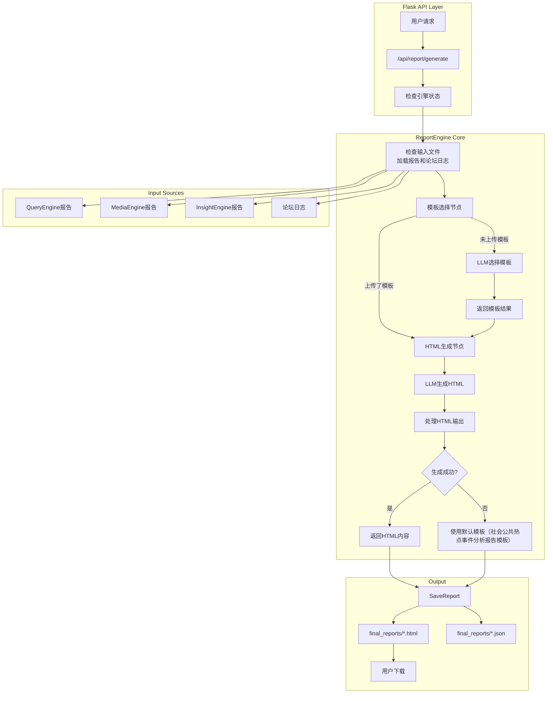

# ReportEngine 流程图

```mermaid
graph TB
    subgraph "Flask API Layer"
        User["用户请求"] --> API["/api/report/generate"]
        API --> CheckStatus["检查引擎状态"]

    end
    
    subgraph "ReportEngine Core"
        CheckStatus --> CheckFiles["检查输入文件<br/>加载报告和论坛日志"]

        CheckFiles --> SelectTemplate["模板选择节点"]
        SelectTemplate -->|上传了模板| GenerateHTML["HTML生成节点"]
        SelectTemplate --> |未上传模板| LLM1["LLM选择模板"]
        LLM1 --> TemplateResult["返回模板结果"]
        
        GenerateHTML --> LLM2["LLM生成HTML"]
        LLM2 --> ProcessOutput["处理HTML输出"]
        ProcessOutput --> Fallback{"生成成功?"}
        Fallback -->|是| HTMLResult["返回HTML内容"]
        Fallback -->|否| FallbackHTML["使用默认模板（社会公共热点事件分析报告模板）"]
    end
    
    subgraph "Input Sources"
        CheckFiles --> QueryReport["QueryEngine报告"]
        CheckFiles --> MediaReport["MediaEngine报告"]
        CheckFiles --> InsightReport["InsightEngine报告"]
        CheckFiles --> ForumLogs["论坛日志"]
    end
    
    subgraph "Output"
        SaveReport --> HTMLFile["final_reports/*.html"]
        SaveReport --> StateFile["final_reports/*.json"]
        HTMLFile --> Download["用户下载"]
    end
    
    TemplateResult --> GenerateHTML
    HTMLResult --> SaveReport
    FallbackHTML --> SaveReport
```
