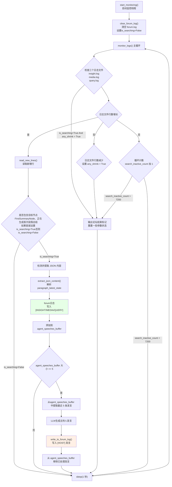

## Forum Engine 执行流程图

```mermaid
graph TB
  
    StartMon["start_monitoring()<br/>启动监控线程"] --> ClearLog["clear_forum_log()<br/>清空 forum.log<br/>设置is_searching=False"]
    
    ClearLog --> MonLoop["monitor_logs() 主循环"]
    
    MonLoop --> CheckFiles{"检查三个日志文件<br/>insight.log<br/>media.log<br/>query.log"}
    CheckFiles -->|is_searching=True And any_shrink = True| EndSession

    CheckFiles --> DetectGrowth{"日志文件行数增长"}
    
    DetectGrowth -->|是| ReadNew["read_new_lines()<br/>读取新增行"]


    ReadNew --> CheckTarget{"是否包含目标节点<br/>FirstSummaryNode、正在生成首次段落总结<br/>如果是就设置is_searching=True否则is_searching=False"}
    
   
    
    CheckTarget -->|is_searching=True| ProcessLines["检测并提取 JSON 内容"]
    CheckTarget -->|is_searching=False| Sleep

    ProcessLines --> ExtractJSON["extract_json_content()<br/>解析 paragraph_latest_state"]
  
    ExtractJSON --> WriteAgent["forum日志<br/>写入 [INSIGHT/MEDIA/QUERY]"]
    WriteAgent --> AddBuffer["添加到<br/>agent_speeches_buffer"]
    
    AddBuffer --> CheckThreshold{"agent_speeches_buffer 大小 >= 5"}
    
    CheckThreshold -->|是| GetRecent["从agent_speeches_buffer 中提取最近 5 条发言"]
 
    GetRecent --> FormatSpeech["LLM生成主持人发言"]
    
    FormatSpeech --> WriteHost["write_to_forum_log()<br/>写入 [HOST] 发言"]
    WriteHost --> ClearBuffer["从 agent_speeches_buffer 移除已处理发言"]

    
    CheckThreshold -->|否| Sleep
    ClearBuffer --> Sleep
    
    DetectGrowth -->|否| CheckShrink{"日志文件行数减少<br/>设置 any_shrink = True"}
    
    CheckShrink --> EndSession["输出论坛结束标记<br/>重置一些参数状态"]
    EndSession --> Sleep
    
    DetectGrowth -->|否| CheckTimeout{"循环计数search_inactive_count 加 1"}
    CheckTimeout -->|search_inactive_count > 7200 | EndSession
    CheckTimeout -->|search_inactive_count < 7200 | Sleep["sleep(1 秒)"]
    Sleep --> MonLoop
    

  
    style WriteAgent fill:#e6ffe6
    style WriteHost fill:#fff0e6
```

